**ESCUELA TÉCNICA SUPERIOR DE INGENIERÍA INFORMÁTICA**

**GRADO EN DISEÑO Y DESARROLLO DE VIDEOJUEGOS**

**Curso Académico 2023/2024**

**Trabajo Fin de Grado**

**MECÁNICAS EN LOS VIDEOJUEGOS DE GÉNERO RPG**

> **Autor**: Jaime Jiménez López
>
> **Directores**: Daniel Burón García, Carlos Garre del Olmo

|  |
|----|
| MECÁNICAS EN LOS VIDEOJUEGOS DE GÉNERO RPG © 2024 de Jaime Jiménez López se distribuye bajo la licencia Atribución-NoComercial-CompartirIgual 4.0 Internacional de Creative Commons. Para ver una copia de esta licencia, visitar <http://creativecommons.org/licenses/by-nc-sa/4.0/> |

#

# Resumen

Unos de los videojuegos más populares actualmente son los del género
Role-Playing Game o RPG. Esto es debido a que ofrecen experiencias
inmersivas en mundos virtuales a través de una buena narrativa, la
creación y personalización de personajes, la progresión y la mejora de
estos a medida que se avanza en la trama; creando así una conexión
emocional con el jugador.

Una de las claves para mantener al usuario jugando el mayor tiempo
posible y poder crear esa conexión es la jugabilidad, la cual queda
determinada en parte por un conjunto de mecánicas propias de este género
de videojuegos. El objetivo de este trabajo es el estudio de estas
mecánicas, cuáles son las más comunes y las diferentes formas de
aplicarlas dependiendo del estilo de juego deseado.

Para finalizar, se desarrollará una aplicación práctica en Unity
programando las mecánicas más comunes estudiadas anteriormente generando
una plantilla como base para crear videojuegos de género RPG por turnos
cambiando el arte, la historia, los personajes, etc. Todo con la
finalidad de aprender y mejorar en el desarrollo de estos.

**Palabras clave:** videojuegos, género Role-Playing Game (RPG),
experiencias inmersivas, narrativa, creación de personajes,
personalización, progresión, mejora de personajes, conexión emocional,
jugabilidad, mecánicas, aplicación práctica, Unity, desarrollo de
videojuegos.

# 

# Abstract

One of the most popular video game genres today is Role-Playing Games,
or RPGs. This is because they offer immersive experiences in virtual
worlds through a compelling narrative, character creation and
customization, character progression and improvement as the plot
unfolds, thus creating an emotional connection with the player.

One of the keys to keeping the user engaged for as long as possible and
creating that connection is gameplay, which is partially determined by a
set of mechanics unique to this genre of video games. The aim of this
work is to study these mechanics, identify the most common ones, and
explore different ways to implement them depending on the desired style
of gameplay.

To conclude, a practical application will be developed in Unity by
implementing the most common mechanics studied earlier, generating a
template as a basis for creating turn-based RPG genre video games,
changing the art, story, characters, etc. All with the purpose of
learning and improving in their development.

**Keywords:** video games, Role-Playing Game (RPG) genre, immersive
experiences, narrative, character creation, customization, progression,
character improvement, emotional connection, gameplay, mechanics,
practical application, Unity, game development.

# 

# Índice de contenido

[Resumen [I](#resumen)]

[Abstract [II](#abstract)]

[Índice de contenido [III](#_Toc163153047)]

[Índice de figuras [VI](#índice-de-figuras)]

[1. Introducción [1](#introducción)]

[1.1. Contexto y relevancia de los juegos de rol en la industria del
videojuego
[1](#contexto-y-relevancia-de-los-juegos-de-rol-en-la-industria-del-videojuego)]

[1.2. Justificación del estudio de las mecánicas en los RPGs
[2](#justificación-del-estudio-de-las-mecánicas-en-los-rpgs)]

[1.3. Objetivos de la investigación
[3](#objetivos-de-la-investigación)]

[2. Metodología [5](#metodología)]

[2.1. Planificación [5](#planificación)]

[2.2. Metodología Kanban [6](#metodología-kanban)]

[2.2.1. ¿Qué es? [6](#qué-es)]

[2.2.2. Ventajas de usar Kanban
[6](#ventajas-de-usar-kanban)]

[2.2.3. Proceso de implementación
[7](#proceso-de-implementación)]

[2.2.4. Metodología Kanban en este proyecto
[8](#metodología-kanban-en-este-proyecto)]

[3. Mecánicas en los RPGs
[11](#mecánicas-en-los-rpgs)]

[3.1. Subgénero RPG según su lugar de desarrollo
[11](#subgénero-rpg-según-su-lugar-de-desarrollo)]

[3.1.1. WRPG – RPG occidental
[12](#wrpg-rpg-occidental)]

[3.1.2. JRPG – RPG japonés [19](#jrpg-rpg-japonés)]

[3.2. Subgénero RPG según su estilo de combate
[20](#subgénero-rpg-según-su-estilo-de-combate)]

[3.2.1. Combate por turnos
[20](#combate-por-turnos)]

[3.2.2. ARPG – RPG de acción.
[25](#arpg-rpg-de-acción.)]

[3.2.3. Shooter RPG – Juegos de rol de disparos
[26](#shooter-rpg-juegos-de-rol-de-disparos)]

[3.2.4. SRPG – RPGs estratégicos
[27](#srpg-rpgs-estratégicos)]

[3.3. Subgénero RPG según su enfoque
[28](#subgénero-rpg-según-su-enfoque)]

[3.3.1. MMORPG – RPGs multijugador masivos en línea
[29](#mmorpg-rpgs-multijugador-masivos-en-línea)]

[3.3.2. Dungeon Crawlers – RPGs de mazmorras
[30](#dungeon-crawlers-rpgs-de-mazmorras)]

[3.3.3. RPGs Gacha [36](#rpgs-gacha)]

[3.4. Mecánicas comunes en los RPGs
[38](#mecánicas-comunes-en-los-rpgs)]

[3.4.1. Mecánica de farmeo
[38](#mecánica-de-farmeo)]

[3.4.2. Mecánica de elementos
[39](#mecánica-de-elementos)]

[4. Aplicación práctica
[41](#aplicación-práctica)]

[4.1. Mecánica de diálogos
[41](#mecánica-de-diálogos)]

[4.1.1. Diseño [41](#diseño)]

[4.1.2. Desarrollo [43](#desarrollo)]

[4.2. Mecánica de formación de equipo
[44](#mecánica-de-formación-de-equipo-1)]

[4.2.1. Diseño [44](#diseño-1)]

[4.2.2. Desarrollo [45](#desarrollo-1)]

[4.3. Mecánica de información del personaje
[47](#mecánica-de-información-del-personaje)]

[4.3.1. Diseño [47](#diseño-2)]

[4.3.2. Desarrollo [48](#desarrollo-2)]

[4.4. Mecánica de subir nivel
[49](#mecánica-de-subir-nivel)]

[4.4.1. Diseño [49](#diseño-3)]

[4.4.2. Desarrollo [51](#desarrollo-3)]

[4.5. Mecánica de equipamiento
[53](#mecánica-de-equipamiento)]

[4.5.1. Diseño [53](#diseño-4)]

[4.5.2. Desarrollo [56](#desarrollo-4)]

[4.6. Mecánica de mejora de equipamiento
[58](#mecánica-de-mejora-de-equipamiento)]

[4.6.1. Diseño [58](#diseño-5)]

[4.6.2. Desarrollo [60](#desarrollo-5)]

[4.7. Mecánica de comerciar equipamiento
[64](#mecánica-de-comerciar-equipamiento)]

[4.7.1. Diseño [64](#diseño-6)]

[4.7.2. Desarrollo [65](#desarrollo-6)]

[4.8. Mecánica de combate
[68](#mecánica-de-combate)]

[4.8.1. Diseño [68](#diseño-7)]

[4.8.2. Desarrollo [71](#desarrollo-7)]

[4.9. Mecánica de mapa de nodos
[78](#mecánica-de-mapa-de-nodos)]

[4.9.1. Diseño [78](#diseño-8)]

[4.9.2. Desarrollo [81](#desarrollo-8)]

[5. Conclusiones [84](#conclusiones)]

[6. Bibliografía [86](#bibliografía)]

**  
**

# 

# Índice de figuras

[Figura 1.1. Dungeons & Dragons
(https://www.teknoplof.com/2019/01/23/el-primer-rpg-de-la-historia-vio-la-luz-en-1974-the-game-of-dungeons-dnd/)
[2](#_Ref156473281)]

[Figura 2.1. Tablero Kanban post-its
(https://kanbantool.com/es/metodologia-kanban)
[6](#_Ref161241395)]

[Figura 2.2. Trello, definición del flujo de trabajo
[8](#_Ref161241589)]

[Figura 2.3. Trello, columna bugs [9](#_Ref161241680)]

[Figura 2.4. Trello, seguimiento del trabajo
[9](#_Ref161241723)]

[Figura 3.1. Mapa completo de Horizon: Zero Dawn
(https://www.uncomohacer.com/eu/zein-handia-den-zerumuga-zero-egunsentiko-mapa/)
[13](#_Ref161241883)]

[Figura 3.2. Mapa de Slay the Spire
(https://apptrigger.com/2019/01/23/slay-spire-review-shot-corrupt-heart/)
[15](#_Ref161242019)]

[Figura 3.3. Personalización de raza Baldur´s Gate 3
(https://www.youtube.com/watch?v=jUXCTUkRXv8)
[16](#_Ref161242140)]

[Figura 3.4. Personalización de apariencia Baldur´s Gate 3
(https://www.youtube.com/watch?v=jUXCTUkRXv8)
[17](#_Ref161242200)]

[Figura 3.5. Equipamiento Assassin´s Creed Odyssey
(https://www.youtube.com/watch?v=C-yv-kLt_l4)
[18](#_Ref161242377)]

[Figura 3.6. Subir atributos Elden Ring
(https://www.eurogamer.es/elden-ring-niveles-como-subir-nivel-mejores-estadisticas-aumentar-primero)
[19](#_Ref161242940)]

[Figura 3.7. Wizardry: Proving Grounds of the Mad Overlord, 1984
(https://www.myabandonware.com/game/wizardry-proving-grounds-of-the-mad-overlord-a)
[19](#_Ref161243051)]

[Figura 3.8. Combate Final Fantasy XIII
(https://www.hobbyconsolas.com/guias-trucos/final-fantasy-xiii/final-fantasy-xiii-capitulo-11-monstruos-gran-paals-76334)
[21](#_Ref161248706)]

[Figura 3.9. Combate Dragon Quest I
(https://www.youtube.com/watch?v=sCdtDXGppVo)
[22](#_Ref161248785)]

[Figura 3.10. Orden de turnos Baldur´s Gate 3
(https://www.youtube.com/watch?v=UCxFhfQFaec)
[22](#_Ref161248872)]

[Figura 3.11. Formación equipo Digimon World: Adventure
(https://www.youtube.com/watch?v=HztvIuZhjis)
[24](#_Ref161249005)]

[Figura 3.12. Combate contra Malenia. Elden Ring
(https://www.ign.com/wikis/elden-ring/Malenia,\_Blade_of_Miquella_Location_and_Guide)
[25](#_Ref161249271)]

[Figura 3.13. Borderlands 3
(https://www.maniac.de/tests/borderlands-3-im-test-ps4-xbox-one/)
[26](#_Ref161249330)]

[Figura 3.14. Algunas armas y armaduras Destiny 2
(https://www.youtube.com/watch?v=9GOkG61wWhQ)
[27](#_Ref161249491)]

[Figura 3.15. Combate Fire Emblem: Three Houses
(https://www.nintendo.es/Juegos/Juegos-de-Nintendo-Switch/Fire-Emblem-Three-Houses-1175482.html#El_campo_de_batalla)
[28](#_Ref161249594)]

[Figura 3.16. World of Warcraft
(https://www.gamestar.de/artikel/world-of-warcraft-die-monatlichen-kosten-in-europa,1450121.html)
[29](#_Ref161249787)]

[Figura 3.17. Rogue (1980)
(https://es.ign.com/deathloop/176237/feature/la-emocionante-evolucion-del-roguelike-origenes-nicho-y-su-llegada-a-la-primera-plana-en-videojuegos)
[31](#_Ref161250000)]

[Figura 3.18. Perspectiva combate Diablo IV
(https://www.youtube.com/watch?v=Le99uEcuVeU)
[32](#_Ref161250345)]

[Figura 3.19. Combate Pillars of Eternity 2: Deadfire
(https://www.polygon.com/2019/1/23/18194374/pillars-of-eternity-2-deadfire-preview-impressions)
[34](#_Ref161251540)]

[Figura 3.20. Tiradas de dados Baldur´s Gate 3
(https://www.irrompibles.net/50929-baldurs-gate-3-review-en-progreso/)
[35](#_Ref161251602)]

[Figura 3.21. Cápsulas gachapon
(https://laguiacentral.com/guias/que-son-los-juegos-gacha/)
[36](#_Ref161251732)]

[Figura 3.22. Banners para tirar en Black Clover Mobile
[37](#_Ref161251864)]

[Figura 3.23. Farmear experiencia con combates. Pokémon: Heart Gold
(https://www.youtube.com/watch?v=1J2modO5ZtM)
[38](#_Ref161252356)]

[Figura 3.24. Rueda de elementos básicos
(https://www.destinorpg.es/2022/02/los-elementos-en-el-genero-rpg-2.html)
[40](#_Ref156473325)]

[Figura 4.1. Narrador inicial [42](#_Ref161255716)]

[Figura 4.2. Narrador en diálogos entre personajes
[42](#_Ref161255732)]

[Figura 4.3. Diálogo interactivo con dos opciones de respuesta
[43](#_Ref161255819)]

[Figura 4.4. Canvas creado para el Dialogue System
[43](#_Ref161255874)]

[Figura 4.5. Nodos de conversación [44](#_Ref161256488)]

[Figura 4.6. Pantalla de formación de equipo
[45](#_Ref161256560)]

[Figura 4.7. Funciones de clicar, arrastrar y soltar de uno de los
scripts del objeto de personaje [46](#_Ref161256614)]

[Figura 4.8. Parte de código del ejemplo explicado perteneciente a las
casillas de la formación [46](#_Ref161256770)]

[Figura 4.9. Función realizada por el botón "Atrás"
[47](#_Ref161256867)]

[Figura 4.10. Inventario de personajes
[47](#_Ref161256946)]

[Figura 4.11. Información del personaje Zindrael
[48](#_Ref161256984)]

[Figura 4.12. Función "CharInventory”: instancia los personajes del
inventario [49](#_Ref161257116)]

[Figura 4.13. Función "OnPointerClick"
[49](#_Ref161257156)]

[Figura 4.14. Pantalla inicial de subir nivel de un personaje
[50](#_Ref161304229)]

[Figura 4.15. Seleccionar objetos de subir nivel
[51](#_Ref161304275)]

[Figura 4.16. Función "UpdateExp": calcula y actualiza el valor de la
slider de experiencia, el nivel si fuese necesario y las estadísticas
que se sumarían al subir nivel [52](#_Ref161304548)]

[Figura 4.17. Función "LvlUp" [53](#_Ref161304720)]

[Figura 4.18. Pantalla de equipamiento
[54](#_Ref161304981)]

[Figura 4.19. Arma equipada correcta e incorrecta
[54](#_Ref161305076)]

[Figura 4.20. Pestaña de armaduras [55](#_Ref161305131)]

[Figura 4.21. Estadística aumentada según nombre de pieza de equipo
[55](#_Ref161305237)]

[Figura 4.22. Bonificación de estadística por tipo de equipamiento
[56](#_Ref161305284)]

[Figura 4.23. Función "UpdateBonusTxt" y parte de la función
"CheckBonus” en la que comprueba si hay 1, 2 y 3 objetos del mismo tipo
(también lo hace con 4, 5, y 6) [57](#_Ref161305583)]

[Figura 4.24. Parte de añadir de la función "AddSubtractStats" y función
"ChangeStatBonusCount” [57](#_Ref161305770)]

[Figura 4.25. Parte de equipar de función "UpdateCharStats"
[58](#_Ref158807759)]

[Figura 4.26. Pantalla de mejora de equipamiento
[59](#_Ref161308261)]

[Figura 4.27. Algunos estados botón mejora de equipamiento
[59](#_Ref161308451)]

[Figura 4.28. Función "CanUpAwGear"
[61](#_Ref161308491)]

[Figura 4.29. Primera parte función "UpgradeAwakeGear"
[62](#_Ref161309389)]

[Figura 4.30. Función "SetAwUpValues"
[63](#_Ref161309443)]

[Figura 4.31. Pantalla de comerciar equipamiento
[64](#_Ref161650254)]

[Figura 4.32.Monedas insuficientes para comprar
[65](#_Ref161650377)]

[Figura 4.33. Función "ChangeItemInfo"
[66](#_Ref161650726)]

[Figura 4.34. Función "BuyBtn" [67](#_Ref161650750)]

[Figura 4.35. Función "SellBtn" [67](#_Ref161650781)]

[Figura 4.36. Pantalla de combate [68](#_Ref161651502)]

[Figura 4.37. Interfaz buffs y debuffs
[70](#_Ref161651556)]

[Figura 4.38. Nivel de combo [70](#_Ref161652263)]

[Figura 4.39. Relación de elementos
[71](#_Ref158229985)]

[Figura 4.40. Generación de lista de enemigos
[72](#_Ref161652341)]

[Figura 4.41. Función de ataque [73](#_Ref161652377)]

[Figura 4.42. Función de daño [73](#_Ref158289128)]

[Figura 4.43. Función matemática de daño
[74](#_Ref158289646)]
[Figura 4.44. Ajuste de daño según elementos
[74](#_Ref161652523)]

[Figura 4.45. Ataque especial a todos los enemigos
[74](#_Ref161652676)]

[Figura 4.46. Aumento de ataque por sector de combo
[75](#_Ref161653840)]

[Figura 4.47. Aumento de daño por veces acertado el combo
[75](#_Ref161653862)]

[Figura 4.48. Partes de la función general “SpecialAbility” que se
realiza al pulsar el botón correspondiente
[76](#_Ref161653885)]

[Figura 4.49. Función “HealCharacters”: se llama a la función "Heal"
(Figura 4.50) de cada personaje al que se aplica la curación
[76](#_Ref161653935)]

[Figura 4.50. Función “Heal”: se aumenta la vida del personaje
[77](#_Ref161654006)]

[Figura 4.51. Función "DeBuffStats": parte que aumenta el ataque del
personaje [77](#_Ref161654703)]

[Figura 4.52. Función "SetResult" [77](#_Ref161654068)]

[Figura 4.53. Esquema mapa de nodos
[78](#_Ref159062282)]

[Figura 4.54. Primera parte mapa de nodos
[78](#_Ref159062292)]

[Figura 4.55. Pop-up de obtención de objeto
[79](#_Ref161655665)]

[Figura 4.56. Pantalla nodo de mercader
[80](#_Ref161655705)]

[Figura 4.57. Situación de elección en mitad del camino de nodos
[81](#_Ref161655796)]

[Figura 4.58. Función "SelectNode" y "SetNodeSelected"
[82](#_Ref161655946)]

[Figura 4.59. Función "ManageColumns"
[83](#_Ref161655998)]

# 

# Introducción

##  Contexto y relevancia de los juegos de rol en la industria del videojuego

Los juegos de género *Role-Playing Game (RPG)* han desempeñado un papel
fundamental en la industria de los videojuegos desde sus inicios, debido
a que proporcionan a los usuarios experiencias personalizables e
inmersivas en universos imaginarios.

Los RPGs se originaron como juegos de mesa, en ellos los jugadores
interpretan a unos personajes creados por ellos mismos o personalizados.
Pueden modificar su aspecto, su clase y estadísticas iniciales, la raza
si fuera necesario, infinidad de características que dependen de estilo
del juego. Así mismo, toman decisiones que afectan al curso de la
historia y por ende al desarrollo de sus personajes. Todo esto ayuda a
crear conexiones emocionales entre jugadores, personajes e incluso con
el mundo que les rodea provocando una sensación de inmersión que motiva
al usuario a seguir jugando.

Más tarde, se incorporaron al ámbito digital con títulos como el de
“Dungeons & Dragons” (Figura 1.1), juego icónico que sentaría las bases
de los RPGs actuales. Este consistía en recorrer mazmorras dando órdenes
de texto y mejorando el equipo y estadísticas del personaje derrotando a
los enemigos que se cruzaban en el camino.

Desde entonces, se han ido desarrollando y expandiendo en términos de
gráficos, narrativa, jugabilidad y mecánicas, dando paso a sagas de
juegos que tienen millones de seguidores y han sido aclamadas por la
crítica por su inmersiva narrativa y su excepcional jugabilidad como las
de “Final Fantasy”, “The Witcher”, “The Elder Scrolls”, “Baldur’s Gate”,
etc.

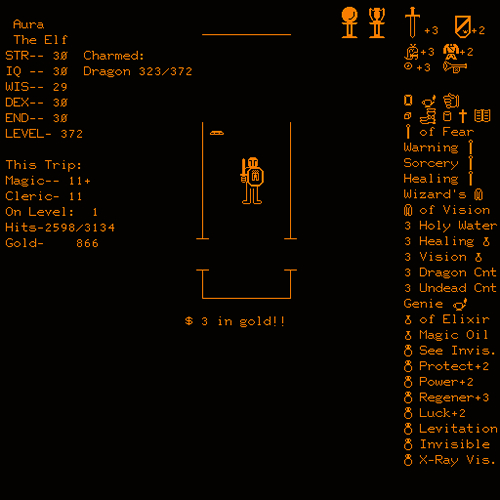

Hoy en día, los juegos de este género siguen siendo relevantes y atraen
a público de todo el mundo. Gracias a la tecnología actual se ha
mejorado la calidad de los universos virtuales y la introducción del
multijugador online ha hecho alcanzar a estos juegos un nuevo nivel de
interacción social.

Además, otros géneros de videojuegos como los de acción, aventura o
estrategia han adoptado elementos de rol en sus títulos enriqueciendo y
profundizando sus experiencias de juego. También se valora cada vez más
el potencial de los RPGs los ámbitos de la educación, la formación y la
terapia ya que estimulan el aprendizaje mediante la experiencia, la
resolución de problemas, el pensamiento crítico y la creatividad.

En resumen, los *Role-Playing Games* han sido claves para impulsar la
industria de los videojuegos, aportando a la mejora de la jugabilidad y
la narrativa. Continúan atrayendo a público de todas las edades y
nacionalidades gracias a su oferta de experiencias inmersivas y por ello
siguen siendo una parte esencial del panorama.

##  Justificación del estudio de las mecánicas en los RPGs

A la hora de desarrollar un RPG hay que tener en cuenta dos piezas
básicas, la primera es la temática y el enfoque que se le quiere dar a
esta dentro del juego, la segunda es la mecánica básica que lo regirá.
Ambos elementos se coordinan juntos, es decir, la mecánica debe ayudar a
desarrollar el videojuego en torno a la temática deseada.

Una de las razones por los que estudiar las mecánicas de los
*Role-Playing Games* antes de diseñar y desarrollar un juego de este
género es el impacto que tienen estas en la jugabilidad, la cual es la
capacidad para mostrar y ejecutar de forma clara y sencilla las
interacciones entre los elementos que conforman el juego (¿Qué es la
jugabilidad en videojuegos?, 2022). Las mecánicas definen en gran medida
la jugabilidad en los videojuegos de rol, la calidad de estas es lo que
determina el nivel de interacción de un usuario con la experiencia de
juego y el desarrollo de su experiencia.

Las mecánicas también determinan el tipo de RPG imprimiéndole un estilo
de juego concreto como centrado más en la acción, en un combate por
turnos, en la estrategia, un *sandbox*, etc. Cada uno de estos tipos
tienen mecánicas específicas que los caracterizan.

Otro punto importante para el éxito de un videojuego es que sea
innovador y te presente mecánicas nuevas que destaquen frente a la
competencia y que se integren correctamente en la jugabilidad ofreciendo
una experiencia fluida y adictiva.

Además, el estudio de las mecánicas en los videojuegos de rol también es
relevante en otros ámbitos como el de la educación o la psicología. Se
utilizan para desarrollar sistemas de aprendizaje y experiencias
interactivas, entre otras cosas.

Resumiendo, el estudio de las mecánicas en los RPGs no solo es esencial
para el éxito de un videojuego de este género, sino que también es
bastante relevante en la interacción de los usuarios con el mundo
virtual, crea la posibilidad de generar nuevos estilos de juego
innovadores y da pie al uso de estos juegos de rol en otros campos como
la educación.

##  Objetivos de la investigación

El objetivo principal de la investigación es profundizar en el estudio
de las mecánicas utilizadas en los videojuegos de género *Role-Playing
Game (RPG)*. Para ello, se plantean los objetivos específicos dispuestos
a continuación:

- Clasificar los videojuegos RPGs en sus respectivos subgéneros,
  identificar y analizar las mecánicas comunes que los hacen juegos de
  rol y discernir aquellas que determinan el subgénero al que
  pertenecen.

- Aplicar algunas de las mecánicas estudiadas en una aplicación práctica
  desarrollada en Unity. Se llevará a cabo el diseño e implementación de
  una plantilla para videojuegos RPG y se explicará por qué se ha
  escogido cada mecánica en función del resultado deseado. Esto consiste
  en utilizar *placeholders* para que, utilizando esta base, se puedan
  crear infinidad de juegos cambiando el estilo del arte, la historia,
  los personajes, etc. También se explicará más técnicamente algunas
  partes del desarrollo.

# 

# Metodología

##  Planificación

Para la planificación de este proyecto se han seguido una serie de pasos
que se dispondrán a continuación:

- **Organización del proyecto:** la primera fase consistió en reuniones
  con compañeros y el tutor para ya que al principio el objetivo era
  desarrollar un videojuego y publicarlo. Se determinó a qué partes de
  este contribuirían cada persona. Más tarde se llegó a la conclusión de
  que era mejor realizar una aplicación práctica individual más centrada
  en el interés de cada integrante.

- **Diseño del “videojuego”:** aunque cada participante realizaría su
  aplicación práctica, la idea del juego sería la misma para todos. Las
  partes para diseñar eran la narrativa, posibles inteligencias
  artificiales que poder integrar y las mecánicas, en las que se
  centrará este proyecto. La idea original era desarrollar un videojuego
  RPG con combate por turnos. Se nombraron diferentes juegos de
  referencia y se cogieron ideas de cada uno generando una idea general
  de la que poder partir cada uno de los implicados.

- **Diseño de mecánicas:** teniendo ya la idea general de lo que se
  quería hacer, se realizó un estudio de las mecánicas en los juegos RPG
  \[ver más adelante\], se seleccionaron las que podían encajar mejor
  con el resultado deseado y se pensó cómo moldearlas para poder
  desarrollarlas en la aplicación práctica.

- **Desarrollo de la aplicación práctica:** con una cantidad de tareas
  iniciales se creó un proyecto de Unity, un repositorio en GitHub y un
  tablero de Trello para seguir una metodología Kanban \[ver más
  adelante\] que guiaría y apoyaría el desarrollo de la aplicación.

## Metodología Kanban

###  ¿Qué es?

La metodología Kanban es una subcategoría de las metodologías ágiles
cuyo objetivo es poder comprender el estado general de un proyecto y
todas las acciones vinculadas al mismo de un solo vistazo.

Este sistema de gestión de proyectos fue desarrollado por un ingeniero
japonés de Toyota a finales de los 40. La palabra japonesa “Kan”
significa “visual” en japonés y “Ban” significa “tarjetas”. El resultado
de su unión sería “tarjetas visuales” (Metodología Kanban: qué es y 5
pasos para implementarlo en tu empresa, 2023).

Generalmente, consiste en dividir un tablero en columnas, que
representan las etapas del proyecto, e ir colocando tarjetas, que
representan tareas, en cada una de las columnas dependiendo del estado
de la tarea. Normalmente las columnas tienen por nombre *To do*, *Doing*
y *Done*, que en español sería “Por hacer”, “Haciendo” y “Hecho”. La
tarjeta comienza en la primera columna y va avanzando conforme al
desarrollo de esa tarea hasta completarse. Tradicionalmente se usaban
tableros en blanco con las columnas dibujadas y las tarjetas eran
*post-its* (Figura 2.1)*.* Actualmente se utilizan tableros y tarjetas
virtuales en entornos como Trello (Figura 2.2).

###  Ventajas de usar Kanban

Las ventajas que ofrece esta metodología son las siguientes (Cabezas, S.
G. 2022):

- **Transparencia:** todo el equipo involucrado en la gestión del
  proyecto tiene una visión global de este y el punto del proceso en el
  que se encuentra.

- **Mejora de la eficiencia:** permite identificar y eliminar cuellos de
  botella para mejorar el flujo de trabajo.

- **Aumenta la flexibilidad:** es muy flexible y puede adaptarse a
  diferentes entornos.

- **Mejora la calidad:** permite implementar mejoras continuas en el
  proceso de trabajo para garantizar un resultado de alta calidad.

- **Reduce los costes:** elimina actividades innecesarias y redundantes,
  lo que reduce los costes.

###  Proceso de implementación

Las fases principales a la hora de implementar Kanban en un videojuego
son las siguientes (Keith, C., 2020):

- **Definir el flujo de trabajo:** lo primero es crear un tablero,
  visible y accesible para todos los miembros del equipo. Cada una de
  las columnas corresponderá a un estado concreto del flujo de tareas,
  que servirá para saber en qué situación se encuentra cada proyecto. Se
  definen las tareas que serán necesarias para el proyecto y se añaden a
  la fase inicial del tablero.

- **Limitar el trabajo en curso:** se establecen metas asequibles, se
  limitan la cantidad de tareas que pueden estar “en proceso” para
  animar a los miembros del equipo a finalizar tareas individuales y
  evitar realizar varias a la vez y posibilitar el no terminarlas.

- **Implementar políticas de procesos explícitas:** los procesos deben
  estar claramente definidos, publicados y socializados. Se debe alentar
  a todos los miembros del equipo a participar e innovar las políticas
  Kanban.

- **Realizar un seguimiento del trabajo:** realizar un seguimiento
  periódico del ritmo del trabajo, añadir nuevas tareas que deriven de
  las iniciales si es necesario, detectar posibles excesos de carga de
  trabajo y reasignar las tareas de acuerdo con la disponibilidad actual
  del equipo para agilizar el proceso.

- **Evaluar los procesos y áreas de mejora:** cuando todas las tarjetas
  están en estado finalizado, se evalúa el proceso y se detectan
  posibles áreas de mejora para siguientes proyectos.

###  Metodología Kanban en este proyecto

Esta metodología ha sido usada para el desarrollo de la aplicación
práctica, siguiendo los procesos de implementación anteriores que se
adecuaban al proyecto:

- **Definición del flujo de trabajo:** para empezar, se creó un tablero
  en Trello, se añadieron las columnas de *To do*, *Doing* y *Done*, en
  su respectivo orden, y se transformaron las tareas iniciales \[ver más
  atrás\] en tarjetas y se colocaron en la primera columna. Esto se
  muestra en la Figura 2.2.

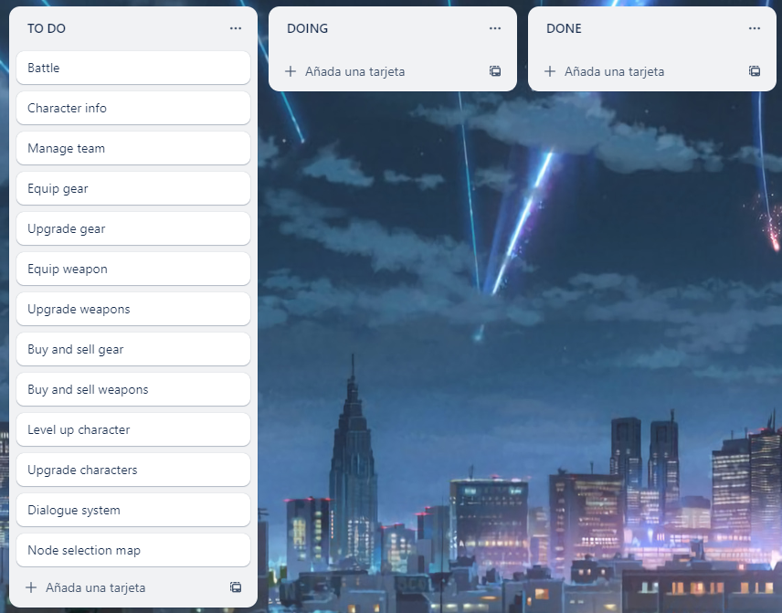

- **Limitación del trabajo en curso:** se definió que solo podía haber 5
  tarjetas al mismo tiempo en la columna de *Doing* para evitar dejar
  tareas en el aire, aunque nunca se ha llegado al límite.

- **Implementar políticas de procesos explícitas:** al ser solo un
  integrante en el desarrollo de la aplicación práctica no había
  necesidad de compartir las políticas con más gente. No obstante, se ha
  definido una regla con el tema de los *bugs.* Es posible haber acabado
  una tarea y haberla movido a la columna de *Done,* pero, a la hora de
  realizar otra, surja un problema o se identifique algo que cambiar en
  alguna anterior. Para gestionar esto, se creó una columna de *Bugs*
  entre la de *Doing* y la de *Done* con límite de 5 tarjetas también
  (Figura 2.3). Entonces si se identificaba este tipo de cosas en una
  tarea finalizada, se arrastraba a esta nueva columna para arreglarlo
  más tarde.

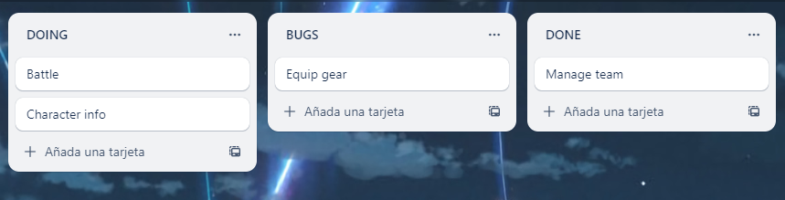

- **Realización del seguimiento del trabajo:** al acabar una tarea, se
  hacían los cambios necesarios en el tablero y se analizaba el tiempo
  que se había tardado en desarrollar para estudiar cómo se podía
  gestionar mejor el tiempo en el caso de que se hubiese determinado que
  había sido demasiado para esa tarea. Después, se revisaban el resto de
  las tareas que se estaban realizando y los *bugs* que había y se
  decidía cuál escoger para seguir desarrollando. En la Figura 2.4 se
  muestra cómo una tarjeta que estaba inicialmente en la columna “To do”
  se ha movido a otras a continuación.

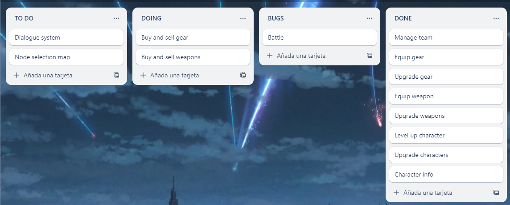

- **Evaluación de los procesos y áreas de mejora:** al finalizar el
  desarrollo de la aplicación práctica, se evaluó el trabajo realizado
  tanto en la aplicación práctica como en los procesos del Kanban. Se
  determinó que se podría mejorar el tiempo de desarrollo estableciendo
  una fecha de entrega y que quizás se podría aprovechar mejor la
  metodología delimitando la realización de tareas a una cantidad de
  tiempo determinado haciendo una estimación de este y sabiendo la
  cantidad de este del que disponemos. También surgió la idea de añadir
  una nueva columna de *Testing* para cuando una tarea necesita ser
  revisada antes de darla por finalizada, ya que en este proyecto se ha
  incluido este proceso en *Doing*.

# 

# Mecánicas en los RPGs

Una de las cosas más complicadas del negocio de los videojuegos es
definir el género de estos. En otros ámbitos se distingue claramente
entre baremos por tema o reacción de la audiencia, y baremos técnicos
(pintura o materiales usados, composición, aspectos estructurales en
arquitectura, etc.). Pero en esta industria, se mezclan varios criterios
a la hora de poner etiquetas a los juegos, y eso resulta en una
clasificación imprecisa. Por ejemplo, un juego puede ser a la vez de
terror y de plataformas, y pese a eso, se usan todas las etiquetas como
definidores del “género”, sin concretar a qué característica se refiere
(Drive, 2017).

Con los juegos de rol pasa lo mismo, entre finales de los 80 y
principios de los 90, cuando se empezaba a asentar una variedad definida
de estilos, “RPG” era una etiqueta amplia pero coherente que englobaba
una serie de atributos jugables y un abanico limitado de ambientaciones
y temas (Drive, 2017). Hoy en día, muchas de las características que
definían este tipo de juegos en esa época están presentes en una gran
cantidad de títulos que no se consideran RPGs o simplemente, forman
parte de estos, pero no lo encasillan en un género en concreto.

Las mecánicas forman parte de estas características y, como se ha
comentado, las que eran únicas de los juegos de rol, ya no lo son. Están
presentes en muchos otros géneros y eso ha propiciado la aparición de
muchos subgéneros los cuales tienen características y mecánicas propias,
pero también otras que son comunes en el resto de RPGs o incluso en otro
tipo de videojuegos. A continuación, se explicarán los distintos
subgéneros según su lugar de desarrollo, su estilo de combate y su
enfoque. Se estudiarán las mecánicas que los hacen pertenecientes a ese
grupo, si las hay, y las que son comunes a todos los demás.

##  Subgénero RPG según su lugar de desarrollo

En una industria cada vez más globalizada suena extraño seguir usando
este criterio como un punto diferenciador pero las disparidades en
influencias entre Japón y occidente, especialmente en este género, son
muy importantes (Adell, 2019).

### WRPG – RPG occidental

Los RPGs occidentales surgieron de los juegos de mesa de rol
influenciados por las obras literarias de “El Señor de los Anillos”,
“Warhammer” y los universitarios de mediados de los años 70, con una
base de tablero, papel y lápiz, tiradas de dados, etc. Estos han sido
relacionados tradicionalmente con la industria de los ordenadores
(Adell, 2017).

El estilo artístico de los WRPG viene mayormente definido por un
realismo estilizado que adopta un enfoque más realista a la hora de
diseñar personajes y entornos, buscando la similitud con
representaciones humanas, aunque también pueden incluir elementos de
fantasía. Además, se presentan entornos más oscuros y maduros con unos
colores más apagados y los escenarios pueden estar influenciados por
épocas históricas o mitología occidental, proporcionando ese tono
realista.

Las narrativas en occidente suelen abordar temas más realistas y a
menudo incluyen elementos de ambigüedad moral y cinismo, con diálogos
pragmáticos. Se tiende a dar más libertad al jugador para tomar
decisiones y moldear la historia, afectando al desarrollo de la trama y
al entorno del juego. Las historias suelen ser menos lineales y más
adaptables, se desarrollan mundos abiertos que permiten al jugador
explorar y realizar misiones secundarias y eventos, dándole libertad
para escoger el orden en que lo hacen. Los personajes a menudo son
personalizables por los jugadores lo que agrega una dimensión adicional
a la narrativa.

Las mecánicas características de los WRPGs que han podido ser más
comunes en estos a lo largo de la historia, además del sistema de
combate en tiempo real \[ver más adelante\], son las siguientes:

#### Mecánica de mundo abierto

El mundo abierto es un modelo de diseño de niveles en el que se le da al
jugador la posibilidad de moverse con libertad por el mundo virtual en
el que se ambienta el juego, e interactuar en gran medida con todos o
casi todos los elementos que lo componen. Aunque a menudo se confunde
con el término *sandbox*, el mundo abierto es una característica de
diseño que puede poseer un juego de cualquier tipo, mientras que el otro
es un género de videojuego que, entre otras características, conlleva la
de tener un mundo abierto (DeVuego, 2013).

Los juegos de mundo abierto suelen ofrecer una gran cantidad de
misiones, tareas y actividades secundarias que los jugadores pueden
emprender a su propio ritmo. Estas misiones pueden incluir combates,
rompecabezas, exploración, recolección de objetos, etc. Estas misiones
pueden ser complementarias a la narrativa principal del juego o
simplemente sirven para mostrar el mundo al usuario, conseguir objetos o
materiales especiales, ganar dinero o experiencia, etc.

Los mapas de los juegos que contienen esta mecánica suelen ser grandes y
diversificados, ofreciendo una amplia gama de entornos, desde ciudades y
pueblos hasta desiertos, montañas, selvas, etc. Cada área puede tener su
propio estilo y desafíos y normalmente se van descubriendo poco a poco a
medida que exploras cada región. Estos suelen tener puntos de control
distribuidos que sirven como punto de reinicio tras la muerte del
jugador o como punto de viaje rápido. Además, es habitual tener un medio
de transporte que agilice movimiento por el mapa como un animal o un
vehículo, dependiendo de la temática del juego. En la Figura 3.1 a
continuación se muestra el mapa de “Horizon: Zero Dawn”, un juego RPG de
mundo abierto.

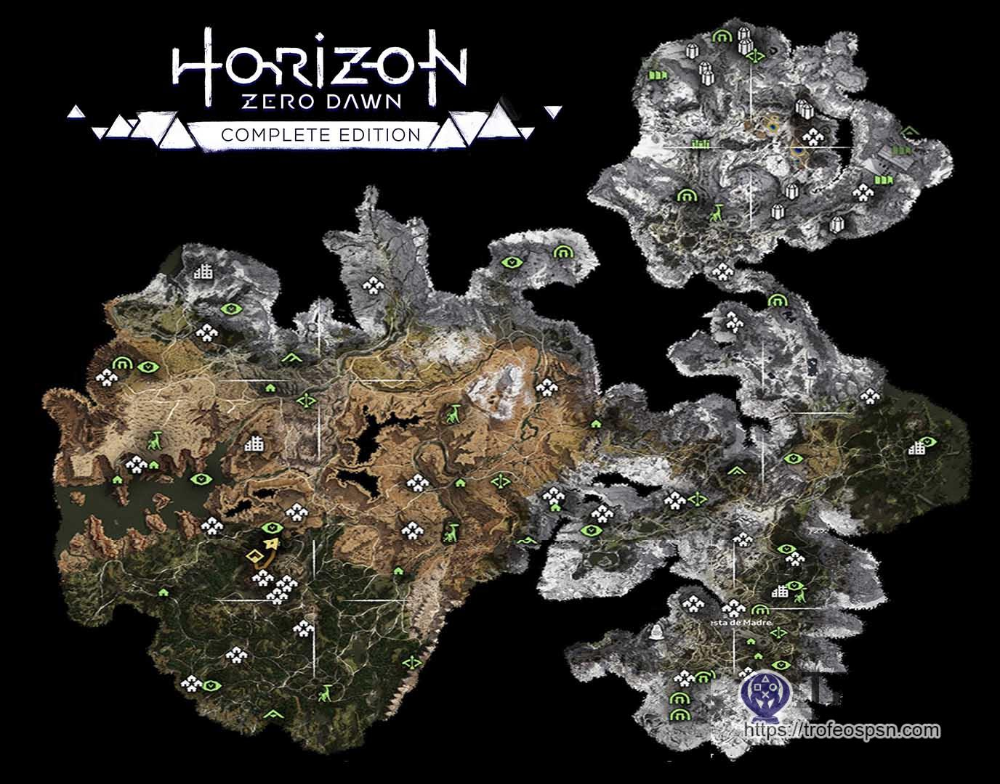

Los jugadores normalmente pueden interactuar con una amplia variedad de
personajes no jugadores (*NPCs*) distribuidos por todo el mundo abierto.
Estos te ofrecen diálogos, comercio, misiones y la construcción de
relaciones con los habitantes del mundo del juego.

A menudo, los juegos de mundo abierto presentan ciclos de día y noche,
así como condiciones climáticas cambiantes que afectan a la jugabilidad,
como por ejemplo algunas misiones que solo se pueden realizar a una hora
en concreto o enemigos que aparecen solo de noche. Además, esto le
agrega realismo y variedad.

Algunos de los títulos más sonados en los últimos tiempos que tienen
incorporados esta mecánica y que además se considera que tienen
elementos RPG son “Elden Ring”, “The Legend of Zelda: Breath of the
Wild”, “The Witcher 3: Wild Hunt”, Grand Theft Auto V”, “Red Dead
Redemption II”, “Horizon: Zero Dawn”, etc. La mayoría de estos han sido
desarrollados en occidente y fueron los primeros en integrar el mundo
abierto, pero hoy en día también se utiliza esta mecánica en juegos
japoneses.

#### Mecánica de toma de decisiones

La toma de decisiones en los videojuegos puede estar presente de muchas
maneras y es una de las características que debe tener un título para
poder considerarle parte del género RPG. Aunque esta mecánica comenzó a
aparecer en los juegos occidentales, hoy en día también está presente en
títulos orientales, además hay juegos que la implementan y no son
considerados de rol.

Un tipo de toma de decisiones son las que afectan al rumbo de la
historia, tanto las que tomas de manera indirecta como matar a un
enemigo para poder obtener una recompensa en concreto, pero luego no
puedes desarrollar su hilo narrativo, como las que tomas de manera
directa como unirte a una facción, matar o salvar a alguien, decir una
cosa u otra o con un tono u otro en un diálogo, etc. Todas estas
decisiones pueden afectar al desarrollo de la narrativa sin alterar el
final o alterándolo, muchos juegos tienen varios finales dependiendo de
las elecciones que haga el usuario. Uno de los métodos para gestionar
esto es el sistema de karma, donde se tiene que elegir entre el bien y
el mal.

Otra de las decisiones que moldean la historia en algunos juegos es la
de por qué lugar avanzar, puede existir la posibilidad de llegar a un
objetivo de diferentes maneras, igual el usuario prefiere enfrentar
menos enemigos antes de pelear contra al jefe final o a más para poder
obtener más recompensas. Si se avanza por caminos diferentes, se podría
reclutar a unos personajes u otros, se podría conseguir diferentes
recompensas, etc. En la Figura 3.2 a continuación se muestra un mapa con
toma de decisiones del juego “Slay the Spire”.

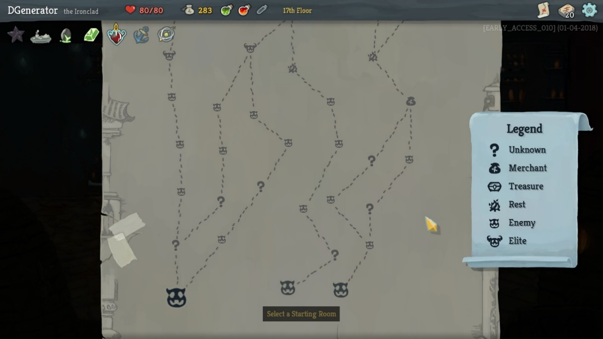

En el caso de que sea necesario formar un equipo de personajes, se puede
seleccionar o reclutar los que lo van a conformar. Decidir si alguien se
une a un equipo puede determinar que otro no lo haga, la
complementariedad de habilidades o estilos de juego de algunos
personajes pueden facilitar el combate u otros apartados del juego,
además de crear un estilo de juego de acuerdo con el usuario o la
situación.

La mecánica de mundo abierto \[ver más atrás\] también da pie a la toma
de decisiones. Se puede elegir si realizar el objetivo principal
directamente o hacer misiones secundarias que te lo facilitan, conseguir
recursos matando monstruos, robando, comerciando, etc. También se puede
elegir hasta cierto punto el orden en que exploras el mapa o los
enemigos que quieres derrotar primero.

Aunque existe el debate de si las novelas visuales forman parte del
género RPG, estas son mayormente guiadas por la mecánica de toma de
decisiones. En ellas suele ser más impactante en la historia la decisión
que toma el jugador (“Life is Strange”, “Detroit: Become Humans”).

#### Mecánica de personalización de personajes

La personalización de personajes es una mecánica fundamental en muchos
juegos de rol. Permite a los jugadores diseñar y ajustar su propio
personaje agregando profundidad y rejugabilidad al juego al permitir a
los jugadores crear un personaje único y personalizar su experiencia de
juego.

En general, al principio del juego, se da la posibilidad de personalizar
varios apartados del personaje que pueden o no afectar a la jugabilidad.
Algunos de ellos son:

- **Nombre**: nombre del personaje.

- **Género**: normalmente hombre o mujer.

- **Origen**: dependiendo del que selecciones el personaje puede tener
  unas competencias más desarrolladas que otras.

<!-- -->

- **Raza**: la selección de este atributo puede variar la apariencia,
  algunas habilidades del personaje y el nivel de algunos atributos. A
  veces es posible escoger también una subraza. En la Figura 3.3 a
  continuación se muestra la selección de raza del personaje en el juego
  “Baldur’s Gate 3”.

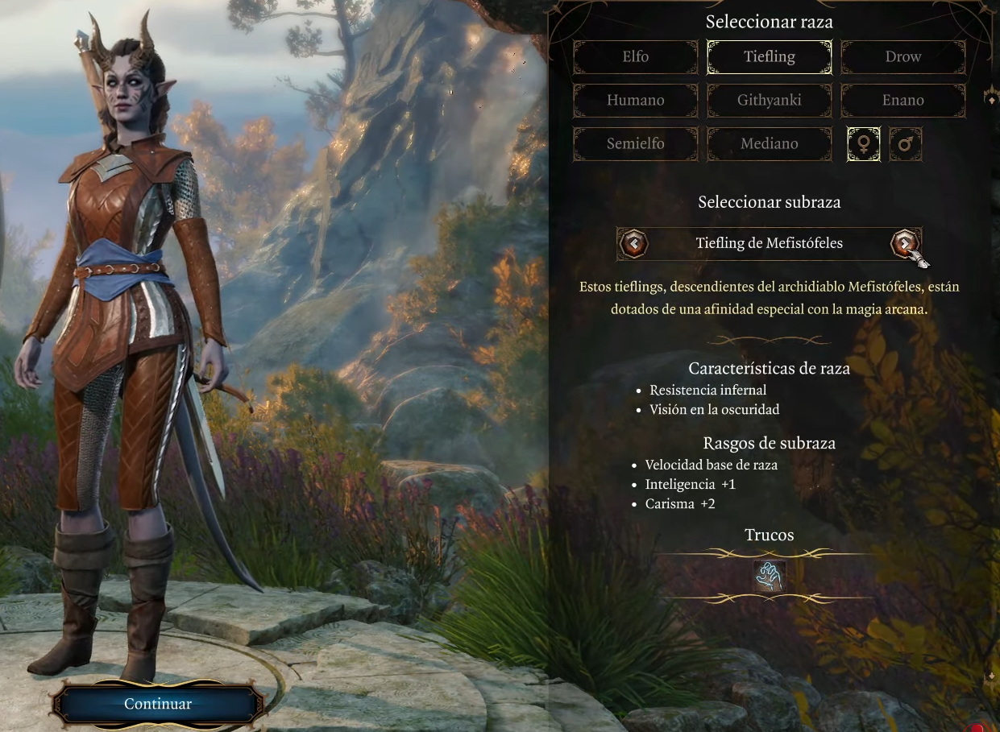

- **Apariencia**: en algunos juegos se puede personalizar enormemente la
  apariencia del personaje. La forma de la cara y del cuerpo, el color
  de la piel, la forma y el color del pelo, el color y tipo de ojos,
  tatuajes y accesorios, etc. En la Figura 3.4 a continuación se muestra
  la personalización de apariencia del personaje en el juego “Baldur’s
  Gate 3”.

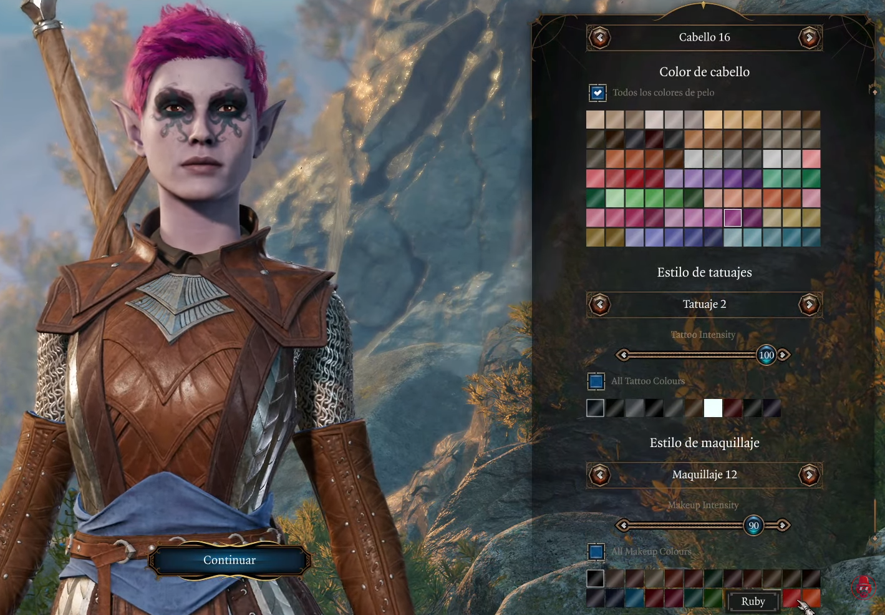

- **Clase**: en general define el estilo de juegos que tiene el usuario
  ya que esta determina las habilidades accesibles del personaje, los
  atributos que tiene más altos o bajos, el tipo de equipamiento que
  puede portar, etc.

Una de las principales formas en las que aparece esta mecánica es a la
hora de equipar el personaje, las armas o las armaduras que porte pueden
amoldarse al estilo de juego del usuario o favorecer el combate contra
un tipo de enemigo en concreto. A veces, por gusto, se permite adoptar
la apariencia de algún arma o parte de una armadura, pero manteniendo
las estadísticas de otra. En algunos juegos, los atributos o la clase
pueden delimitar el equipamiento que puedes llevar. En la Figura 3.5 a
continuación se muestra el equipamiento del personaje en el juego
“Assassin´s Creed Odyssey”.

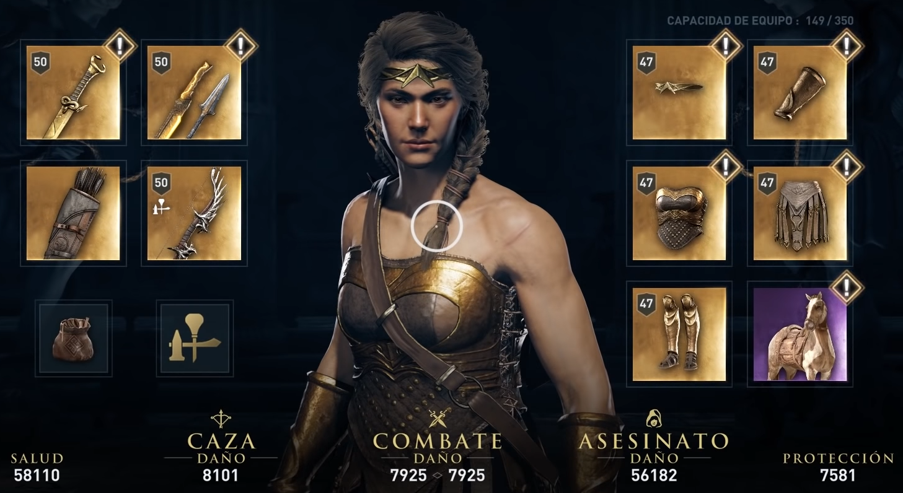

En muchos juegos RPG, es habitual encontrar que los personajes cuentan
con árbol de habilidades. Cada rama del árbol suele representar un tipo
específico de habilidades, como de combate, magia, sigilo, artesanía,
etc. También pueden estar divididas en activas, las cuales se activan
por el usuario mientras juega, y pasivas, que proporcionan beneficios
automáticos. A medida que los jugadores suben de nivel y ganan puntos de
experiencia o habilidades pueden usarlos en el árbol para desbloquear
nuevas. Normalmente, para acceder a habilidades más avanzadas debes
desbloquear las que están anteriormente en la misma rama y se puede
reiniciar el árbol para poder redistribuir los puntos y ajustar las
elecciones que se había hecho. De esta manera se puede personalizar la
experiencia de juego, en parte, al estilo del usuario.

Otra forma de personalizar al personaje en los RPGs es la de seleccionar
qué estadística queremos aumentar al subir de nivel. Por ejemplo, si se
quiere ser tanque se sube la vida y la defensa, si se quiere ser asesino
se subirá la agilidad o la velocidad, si se quiere utilizar combate a
distancia, la precisión. Todo depende de la cantidad de atributos que el
juego tiene en cuenta, pero puede haber infinidad de combinaciones que
desembocan en diferentes *builds* confeccionadas por los jugadores. En
la Figura 3.6 a continuación se muestra la asignación de puntos a
estadísticas tras subir de nivel en el juego “Elden Ring”.

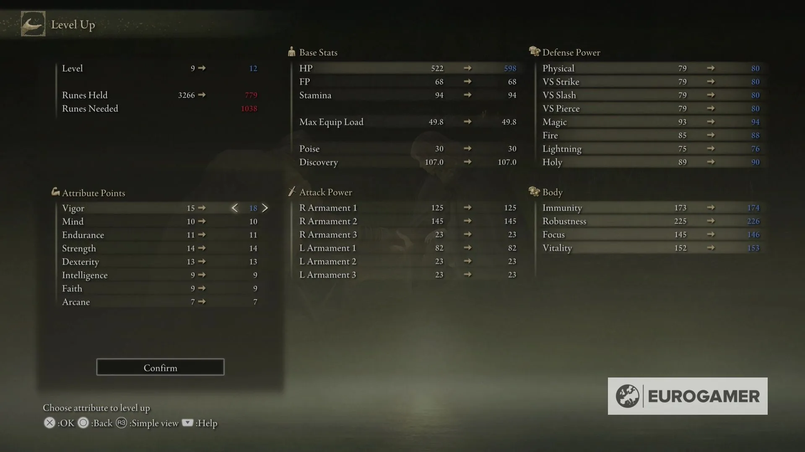

### JRPG – RPG japonés

En Japón, los juegos de rol llegaron de la mano del eco de los primeros
RPGs de ordenador, como “Wizardry” (Figura 3.7), que mostraban un
aspecto centrado en el farmeo y en combate por turnos, ya que no había
medios técnicos que permitiesen emular lo que era una experiencia real
de un juego de rol de mesa. Los japoneses entendieron el género como una
prueba de esfuerzo, paciencia y constancia. La evolución y crecimiento
de este subgénero se ha encontrado completamente ligado a la industria
de las consolas (Adell, 2017).

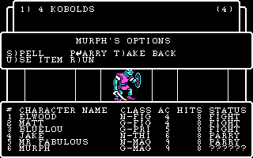

El estilo artístico de estos juegos ha estado influenciado mayormente
por el manga y el anime. Los personajes suelen tener rasgos
característicos de estos artes como ojos grandes y expresivos, peinados
extravagantes y vestimentas llamativas. Se presentan mundos fantásticos
y coloridos con paisajes exuberantes, criaturas mágicas y ciudades
llenas de vida, además de escenarios detallados y surrealistas. También
existe un énfasis en la estilización mediante la exageración de
elementos visuales buscando acentuar emociones, personalidad y los temas
de la historia.

En cuanto a la narrativa, las historias en los JRPGs suelen ser épicas y
emocionales, los personajes principales se enfrentan a desafíos enormes
y eventos catastróficos que amenazan el mundo. Predominan las temáticas
de amistad, amor sacrificio y redención y se adopta un tomo
melodramático y emotivo, con diálogos expresivos y teatrales. Las tramas
pueden incluir elementos de magia, dioses, criaturas míticas y mundos
fantásticos. Los personajes están altamente desarrollados buscando la
conexión emocional con el jugador a medida que se avanza en la historia.
La narrativa tiende a ser lineal, con eventos predefinidos que siguen
una secuencia concreta y guían al usuario a través de un camino
estructurado.

La principal característica propia de los juegos de rol japoneses ha
sido el sistema de combate por turnos \[ver más adelante\], no han
tenido casi ninguna más, ya que estos han sido inspirados por los
occidentales. Se han diferenciado más por el estilo artístico y las
narrativas.

##  Subgénero RPG según su estilo de combate

Esta es la principal diferenciación del género. Definir la manera en la
que se afronta la mecánica que más tiempo se va a estar experimentando
es una parte esencial del diseño de un videojuego. Esto atraerá a un
tipo de jugadores u otros dependiendo de si está enfocada en la
puntería, la estrategia, la habilidad, la planificación, etc. Hay
títulos que mezclan algunos de estos estilos y son complicados de
considerar, pero en términos generales el criterio habitual es el
siguiente.

###  Combate por turnos

El sistema de combate por turnos se caracteriza por dividir el flujo de
acción de una batalla en rondas o turnos. Al encontrarse con uno o
varios enemigos, de manera aleatoria o no, el jugador toma el control de
uno o varios personajes para derrotarlos mediante una serie de comandos
y así acabar el enfrentamiento. Las acciones que realizan el jugador y
los enemigos tienen asignadas un orden, llamado turno. Estas se
intercalarán siguiendo una serie de reglas para determinar cuales se
realizan antes. Las acciones sueles ser atacar, defender, usar objetos,
habilidades, habilidades especiales, moverse por el mapa o incluso huir.
Se desarrollará un turno tras otro hasta finalizar el enfrentamiento
(Del Águila M., C., 2023).

La prioridad a la hora de definir el orden de acción de los personajes
puede ser determinada de varias formas:

- **Sistema de Batalla en Tiempo Activo (ATB)**: surge por primera vez
  en los “Final Fantasy”. El sistema está regido por una barra que se va
  llenando a lo largo del tiempo en función de determinadas estadísticas
  del personaje como la velocidad o la agilidad. Esta puede estar
  dividida en segmentos, realizar una acción consume una parte o una
  cantidad de estos. Por ejemplo, un ataque normal podría costar un
  segmento de la barra y, un ataque o habilidad especial, dos. Si la
  barra tiene suficientes partes disponibles se podría realizar una
  cadena o un combo de ataques que hicieran más daño. En la Figura 3.8 a
  continuación se muestra el sistema de combate ATB del juego “Final
  Fantasy XIII”.

> 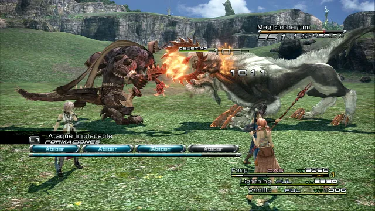 alt="Imagen que contiene pasto, exterior, campo, perro Descripción generada automáticamente" />
>
> Se considera combate por turnos porque al realizar acciones y consumir
> parte de la barra hay que esperar a que vuelva a llenarse lo
> suficiente para poder volver a hacerlas. Lógicamente, el enemigo se
> rige por el mismo sistema e irá atacando en función de su barra. El
> jugador debe poder reaccionar en tiempo real a estas acciones mediante
> una estrategia en la que la complementariedad de los miembros del
> equipo suelen ser una parte importante. En algunos juegos también se
> puede realizar la acción de moverse por el campo de batalla.

- **Sistema de “ronda fija”:** presenta una estructura más tradicional
  en la que personajes y enemigos esperan su turno, claramente definido,
  para poder realizar acciones.

> La forma más clásica de desarrollarse el combate es la intercalación
> de turnos entre el usuario y los enemigos a razón de 1-1. Primero
> realiza el jugador las acciones deseadas ya sea con un personaje o con
> varios y seguidamente las realiza el enemigo, sin importar ninguna
> estadística que determine el orden de inicio. Suele ser habitual en
> juegos de móvil y en los primeros RPG. En la Figura 3.9 a continuación
> se muestra el sistema de combate de ronda fija 1-1 del juego “Dragon
> Quest I”.

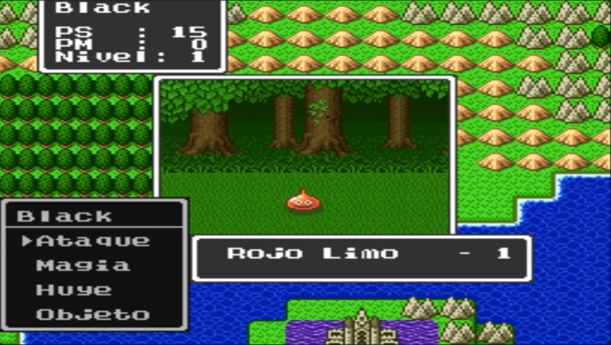

> No obstante, en la mayoría de los juegos que implementa este sistema,
> el orden del turno suele venir dado por algún atributo de los
> personajes como la agilidad o la velocidad. Se puede saber el orden en
> el que se efectuarán o no, se pueden elegir las acciones a realizar de
> todos los miembros del equipo tanto aliados como enemigos y que luego
> se desarrollen todos los turnos hasta la siguiente ronda que se
> volverán a elegir acciones o se puede ir escogiendo la acción a
> realizar a medida que avanzan los turnos uno a uno. En la Figura 3.10
> a continuación se muestra el orden de ataque de los personajes
> implicados en él del juego “Baldur’s Gate 3”.

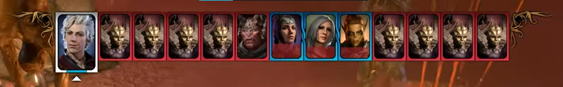

> Dicho esto, existen infinidad de variedades de este sistema, ya que ha
> ido evolucionando con el tiempo para no quedarse obsoleto y no parecer
> monótono y aburrido, además de adaptar la jugabilidad al dispositivo
> en el que se juega (consola, ordenador, móvil, consola portátil,
> etc.). Por ejemplo, para poder hacer un ataque especial, dar un botón
> en un momento determinado, realizar un patrón con el dedo en un móvil,
> pulsar una secuencia de botones, parar una ruleta en un punto en
> concreto que determina qué ataque realizar, tener que romper un escudo
> primero para poder hacer daño al enemigo, etc.

#### Mecánica de formación de equipo

Esta es una mecánica que, aunque aparece en otro tipo de juegos y en
títulos con otro sistema de combate, apareció originalmente en los
primeros RPGs cuyo sistema de batalla era por turnos, ya que estaban
basados en los juegos de rol de mesa que ya aplicaban este método.

Consiste en reclutar y seleccionar personajes, normalmente entre una
variedad de opciones, para que formen parte del equipo del jugador. En
general, se va encontrando estos personajes a lo largo del juego y de
alguna manera se añadían al equipo. Por ejemplo, quieren ayudar al
protagonista a cumplir su objetivo porque los ha salvado, tienen un
propósito en común, se ven obligados, etc. En algunos juegos, como
“Pokémon”, capturas a tus compañeros, ya que son estos los que van a
combatir por ti, en otros dependiendo de si se toma un camino u otro se
puede reclutar a personajes diferentes, también se puede tener la
elección de aceptar la propuesta de colaboración o no, se puede tener
disponible la ayuda desde el principio del juego, etc.

Una vez reclutados los compañeros, es la hora de seleccionar qué
personajes se quiere utilizar en el equipo, ya que normalmente la
cantidad es limitada. Cada personaje suele tener sus habilidades y
atributos propios, así como un rol específico que aporta algo diferente
al grupo dependiendo del que sea. Por ejemplo, añadir un tanque
garantiza una buena defensa, un sanador aporta curaciones y aguante, un
arquero facilita el ataque a distancia, etc. La complementariedad de
estos es vital para la formación de un buen equipo. En la Figura 3.11 a
continuación se muestra la pantalla para formar equipo antes del combate
en el juego “Digimon World: Adventure”.

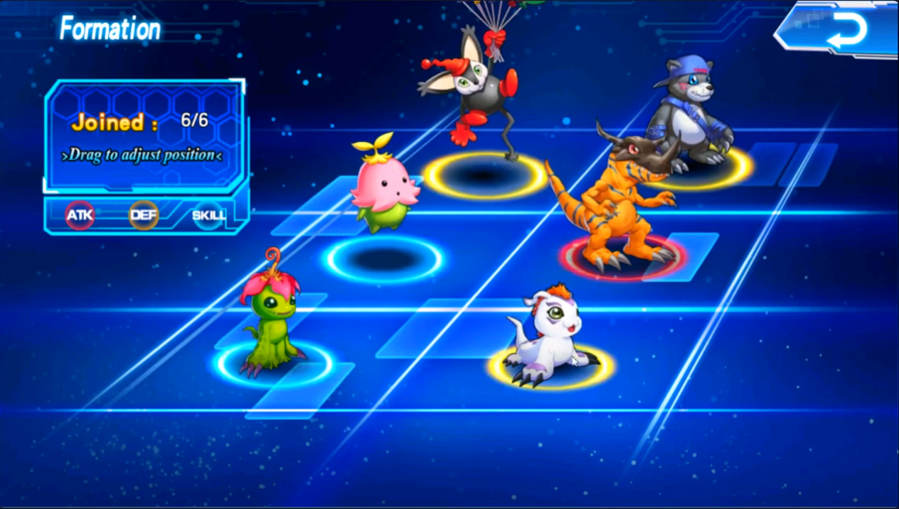

Dependiendo del juego, la formación en el campo de batalla es importante
o no. Si lo es, normalmente se elige antes de combatir, ya que esta
puede determinar la estrategia a seguir y, por ende, vencer o perder. Si
no lo es, simplemente con tener los miembros seleccionados puede ser
suficiente. Volviendo al ejemplo anterior de “Pokémon”, solo se combate
con uno a la vez, en ocasiones dos, y se puede ir cambiando entre el que
está activo y los que están a la espera, en función de la estrategia
propia o la del enemigo. Este estilo de combate se denomina de rotación
activa.

Es habitual ir mejorando a los personajes del equipo a medida que se
avanza en el juego, subir sus niveles y estadísticas, equiparles con
mejores armas y armaduras, mejora o aprendizaje de habilidades, etc.
Normalmente, la cantidad de recursos para hacer esto es limitado o lleva
un tiempo conseguirlos y, por tanto, es importante elegir qué compañeros
mejorar o cuánto hacerlo para tener un equipo equilibrado y
suficientemente fuerte para combatir.

Los juegos actuales enfatizan las interacciones y relaciones entre los
miembros del equipo. Las decisiones del jugador pueden afectar las
dinámicas del grupo y la narrativa general de la historia.

Los juegos de rol en línea permiten la formación de equipos con
jugadores en tiempo real. La cooperación entre estos se convierte en una
parte fundamental de la experiencia, por ejemplo, para derrotar a
monstruos demasiado poderosos si se enfrenta de manera individual. En
estos juegos normalmente existe la posibilidad de crear gremios.

###  ARPG – RPG de acción.

Es un subgénero de los RPG que incorpora elementos de juegos de acción y
aventura, cuya característica principal es que los combates se
desarrollan en tiempo real. Su gran diferenciación con respecto a los
juegos de acción o aventuras radica en la existencia de una evolución
del personaje con un sistema de experiencia, niveles y adquisición de
nuevas habilidades o equipo, aunque normalmente prima por encima de todo
la habilidad del usuario para manejarlo dentro del juego.

Solo se puede tener control directo sobre un personaje a la vez y
normalmente se pueden realizar acciones de atacar, defenderse, esquivar,
correr, saltar, lanzar habilidades especiales, utilizar objetos,
contraatacar, etc. Se trata de un combate más dinámico al estilo *Hack
and Slash*. Si bien solo puedes controlar un personaje, puedes tener
compañeros que actúan de manera automática e incluso a veces se puede
cambiar entre ellos para utilizarlos según la situación.

Al depender en mayor parte de la habilidad del jugador, los combates
contra jefes poderosos pueden resultar difíciles de primeras, teniendo
que aprender los movimientos del enemigo y repitiendo la pelea una y
otra vez para lograr vencerlo. La parte de selección de clases y
habilidades en este tipo de juegos también toma relevancia
complementando el estilo de juego y el nivel de habilidad mecánica del
usuario. En la Figura 3.12 a continuación se muestra el combate contra
el jefe Malenia en el juego “Elden Ring”.

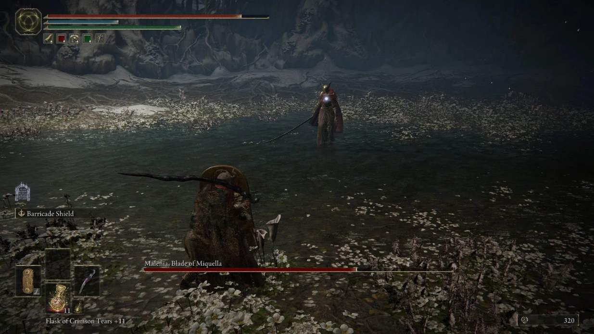

Es habitual que se le dé al jugador más libertad de movimiento, la
capacidad de explorar el mundo o realizar misiones secundarias ya que
esto complementa muy bien la mecánica propia de este subgénero que es el
combate en tiempo real.

Algunos de los títulos más reconocidos que forman parte de este
subgénero son los “Diablo”, los “Dark Souls”, la mayoría de los “The
Legend of Zelda”, los “Monster Hunter”, etc.

###  Shooter RPG – Juegos de rol de disparos

Este subgénero es técnicamente una variante de los RPGs de acción, cuyo
combate también es en tiempo real, con un sistema jugable basado casi en
su totalidad en los *shooters*, con mecánicas como apuntar, disparar,
cubrirse, lanzar granadas, recargar; pero donde la progresión viene dada
por un sistema de experiencia, niveles, equipo y habilidades como en los
videojuegos de rol. En la Figura 3.13 a continuación se muestra el
estilo de combate estilo shooter del juego “Borderlands 3”.

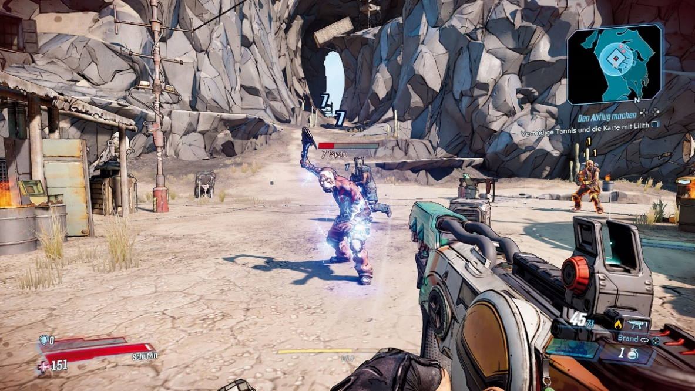

No obstante, casi todos los títulos encasillados en este subgénero
forman parte de otro más específico denominado *looter-shooter*. Además
de las características nombradas anteriormente, destaca otra en
particular y es la que le da la primera parte del nombre, *lootear.*
Originaria de los juegos de rol de mesa, esta mecánica consiste en
obtener armas, armaduras u objetos poderosos y acumularlos tras derrota
enemigos para ir mejorando tu equipo. Normalmente, los jugadores pueden
moverse libremente por un mundo abierto con limitaciones de nivel de
experiencia y de equipo. En la Figura 3.14 a continuación se muestran
algunas armas y armaduras que se pueden lootear en el juego “Destiny 2”.

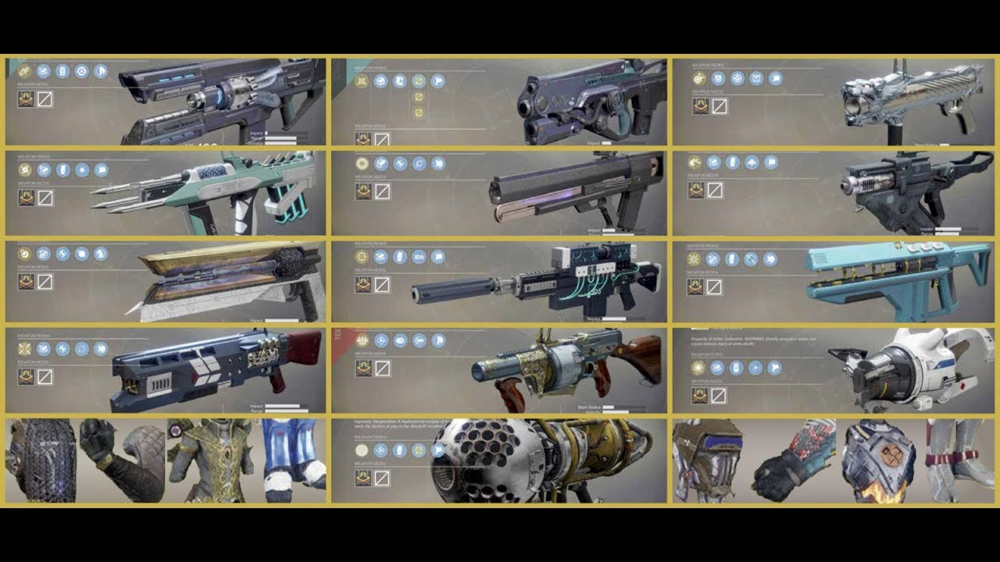

Esta combinación de crecimiento de personaje a largo plazo, la
satisfacción de actualizar el equipo, la adrenalina de los juegos de
disparos, un estilo de arte inusual junto con un buen desarrollo de
historia y personajes han llevado a la saga “Borderlands” a ser el padre
de este subgénero. Además, destacan títulos como “Destiny 2” o “The
Division 2”. La saga “Fallout” también ha tenido mucha repercusión en el
subgénero *shooter* RPGs*.*

###  SRPG – RPGs estratégicos

El rol táctico es un subgénero formado al combinar los videojuegos de
rol con los videojuegos de estrategia. Es el que más se asemeja a los
juegos de rol de mesa debido a los factores explicados a continuación.

Una de sus características principales es que el escenario en el que se
desarrollan las batallas se presenta en cuadrícula, las casillas no
siempre son visibles y pueden presentar desniveles o separaciones entre
ellas. El combate de desarrolla por turnos, normalmente de ronda fija
\[ver más atrás\], donde el jugador deberá ir posicionando, moviendo y
utilizando a los personajes además de aprovechar las propiedades del
terreno para derrotar al enemigo. En la Figura 3.15 a continuación se
muestra el sistema de combate en el videojuego “Fire Emblem: Three
Houses”.

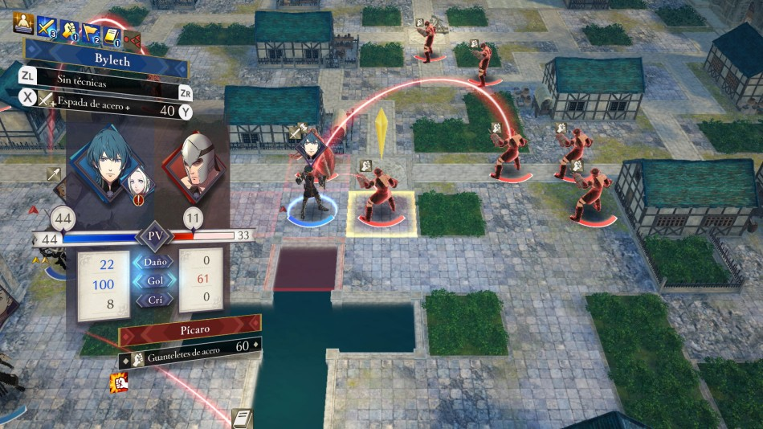

Suele haber una gran cantidad de personajes que el jugador debe ir
reclutando para su equipo, cada uno con sus respectivos ataques,
habilidades o clases. La mecánica más destacada en este tipo de juegos
es que cada uno tiene un rango de ataque o de movimiento que se mide en
cuadrados del escenario. Por ejemplo, un guerrero con lanza puede tener
un rango de dos cuadrados y uno con espada de uno, pero este es más ágil
y puede desplazarse más cuadrados a la vez. Por esto, la selección y la
formación del equipo \[ver más atrás\] es clave para poder avanzar en el
juego. Los personajes pueden ir ganando experiencia y subiendo de nivel
a medida que se avanza y las armas y armaduras mejorándose.

En algunos juegos, las decisiones que se tomen en batalla pueden cambiar
el rumbo de la historia. Puede ocurrir que cuando un personaje muere ya
no puede volver a utilizarse durante el resto del juego.

Los títulos más reconocidos a lo largo de la historia de este subgénero
son los “Fire Emblem” y los “Ogre Battle”.

##  Subgénero RPG según su enfoque

Hay títulos que por su particular ambientación o un sistema de juego
característico han creado estilos en sí mismos. Así pues, existen
subgéneros que dependen más de su concepto que por la forma de combatir,
aunque en la mayoría de estos, la presencia del farmeo \[ver Mecánica de
farmeo\] tiene bastante relevancia (Adell, 2019).

###  MMORPG – RPGs multijugador masivos en línea

Los *Massively Multiplayer Online Role-Playing Games* son videojuegos de
rol, normalmente con un estilo de juego parecido a los RPGs de acción
\[ver más atrás\], donde jugadores de todo el mundo pueden interactuar
entre ellos en línea y con el entorno en un mundo virtual.

Al comenzar el juego lo primero que se tiene que hacer es crear un
personaje y personalizarlo \[ver más atrás\]. La selección de raza o
clase puede alterar en parte la experiencia de juego obligando al
jugador a formar parte de un grupo de jugadores de la misma raza o un
gremio de la misma clase, además de proporcionar un tipo de habilidades
u otras. El desarrollo de los personajes suele estar ligado a un sistema
de puntos de experiencia y niveles que se consiguen combatiendo o
realizando misiones y los cuales sirven para mejorar sus habilidades y
atributos. Una cosa característica de estos juegos es la larga barra de
acciones disponibles para realizar con el personaje, situada en la parte
baja de la pantalla. En la Figura 3.16 a continuación se muestra la
barra de acciones en el juego “World of Warcraft”.

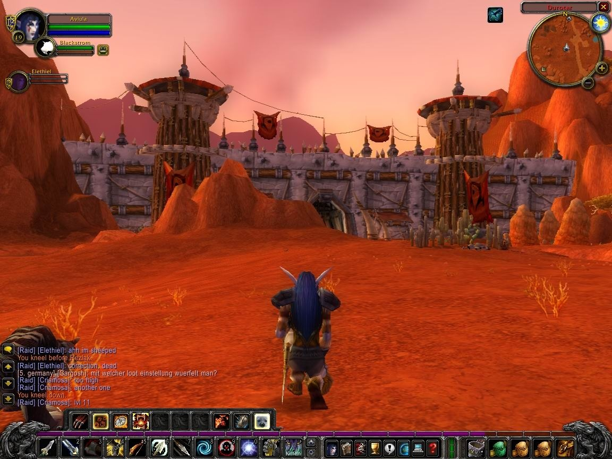

Al ser la interacción social uno de los principales objetivos, es
habitual llegar a un punto del juego en el que es necesario unirse con
otros jugadores para realizar misiones más complicadas o enfrentarse a
enemigos más poderosos, con la consecuente mejora de la recompensa al
completarse. Del mismo, modo se promueve la pelea entre jugadores o
grupos de ellos. Por lo general, existen moderadores o *game masters*,
suelen ser empleados o voluntarios no remunerados, que intentan
supervisar el mundo virtual.

La narrativa de los MMORPGs no suele ser lineal, la historia suele
aparecer al principio del juego para poner al jugador en contexto y se
va desvaneciendo, apareciendo más adelante en forma de misiones. La
temática suele ser fantástica, usando gran parte del universo “Dungeons
& Dragons”, aunque ha ido evolucionando hacia la ciencia ficción, la
magia, los comics, etc. También se han creado mundos basados en
universos como “Star Wars” o “El Señor de los Anillos”. El contenido o
la historia suele ir ampliándose mediante *DLCs* o actualizaciones.

Otra mecánica importante en estos juegos es la economía. Está basada en
una moneda virtual propia del universo ficticio. Los jugadores pueden
crear o conseguir objetos y venderlos o intercambiarlos entre sí o
comerciar con los *NPC*. Es habitual permitir la adquisición de moneda
virtual mediante la compra de esta con dinero real.

El MMORPG por excelencia en los últimos años ha sido “World of
Warcraft”, aunque también destacan títulos como “Guild Wars 2” o “Final
Fantasy XIV Online”.

###  Dungeon Crawlers – RPGs de mazmorras

Los juegos con este enfoque se caracterizan por la mecánica de
exploración de mazmorras. Se trata de niveles laberínticos los cuales el
jugador debe recorrer para poder avanzar donde se puede encontrar
pasadizos secretos, trampas o habitaciones ocultas; sin contar con los
enemigos y, generalmente, uno final más poderoso. Además, se puede
encontrar objetos como consumibles, armas, equipo y demás para usar en
el momento o más tarde.

Partiendo de esta base, han surgido diversos subgéneros marcados por sus
características propias o la relevancia de un título que ha marcado una
tendencia. Son los siguientes:

- **Rogue-likes**: su nombre se origina en el juego “Rogue” (Figura
  3.17), el cual salió al mercado en 1980 y tuvo mucho éxito gracias a
  sus características, las cuales sirvieron como base para la creación
  de muchos otros juegos y que propiciaron la creación de este nuevo
  subgénero.

  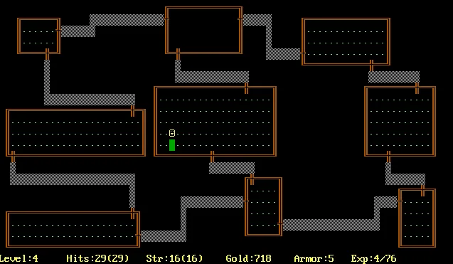

  Una de ellas es la generación procedural de las mazmorras. Los
  niveles, los enemigos, los objetos o los eventos se generan de manera
  aleatoria cada intento o partida. Esto aumenta la rejugabilidad y la
  imprevisibilidad del juego. El escenario suele estar dividido en
  casillas, las cuales representan “salas” de la mazmorra.

  El estilo de combate puede ser por turnos o de acción dependiendo del
  juego. En el segundo caso, la habilidad del jugador prima por encima
  del resto y aprender patrones de los enemigos y perfeccionar
  estrategias es la clave.

  Debido a esto, se ha considerado la elevada dificultad que presentan
  este tipo de juegos como otra característica. Los jugadores deben
  enfrentarse a situaciones desafiantes y a menudo impredecibles. Por
  eso, la exploración debe hacerse cuidadosa y estratégicamente,
  gestionando recursos como la salud y los objetos.

  Otra característica es que la muerte del personaje es permanente, es
  decir, al morir, el jugador debe comenzar desde el principio, lo cual
  aporta un componente de desafío significativo. Normalmente, al morir,
  no se conserva nada de lo que se ha obtenido durante la partida
  anterior, como objetos o habilidades, simplemente el conocimiento
  obtenido.

  En cuanto a narrativa, tiende a ser un elemento secundario. La
  historia puede estar implícita en el entorno, los elementos del juego
  o los personajes.

  En los últimos años, han surgido muchos juegos que adoptan estas
  características, pero no todas. Así ha surgido una variante de este
  subgénero que se denomina *rogue-lite*. Para atraer a más jugadores,
  los títulos han modificado algunas de las mecánicas anteriores. Por
  ejemplo, conservar objetos o habilidades después de cada intento,
  implementar un combate por medio de cartas, más densidad narrativa y
  progreso en la historia a medida que el jugador va realizando
  intentos, no dividir el mapa en casillas, etc.

  El juego más reconocido de este subgénero en los últimos tiempos ha
  sido “The Binding of Isaac”. No obstante, también han destacado otros
  como “Hades”, “Spelunky”, “Dead Cells”, “Inscryption” o “Darkest
  Dungeon”.

- **Diablo-likes**: su nombre se debe al videojuego “Diablo” creado en
  1996 por Blizzard y el resto de los videojuegos de la saga. Sus
  características fueron adoptadas por muchos títulos a lo largo de la
  historia y esto dio pie a la creación de este subgénero.

  La principal es su combate de acción en tiempo real, rápido y
  frenético donde el jugador debe enfrentarse a hordas de enemigos con
  ataques básicos y habilidades las cuales se pueden encadenar. Estas
  normalmente están vinculadas a una barra de habilidades o a una tecla
  o botón específico. También es habitual enfrentarse a jefes épicos y
  desafiantes. En la Figura 3.18 a continuación se muestra el combate
  del juego “Diablo IV”.

  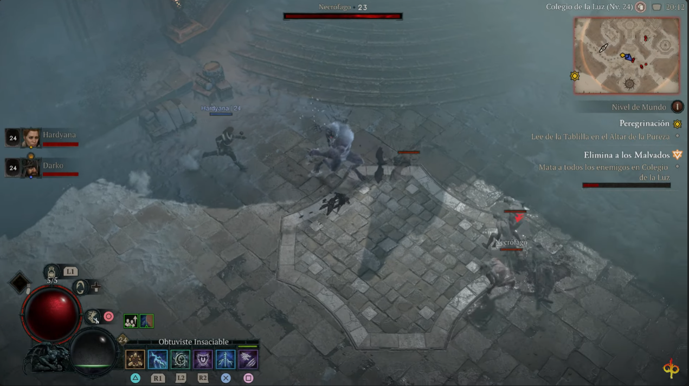

  En este tipo de juegos, las mazmorras se pueden generar de manera
  procedural o no, lo que aporta a cada partida un diseño único. La
  perspectiva suele ser isométrica y desde arriba para mostrar el
  entorno. Es Casi siempre existe un mapa en la interfaz que te guía en
  el mapa y muestra a los enemigos. La ambientación suele ser oscura,
  gótica o fantástica y la narrativa se centra en un héroe o grupo de
  héroes que se enfrentan a las fuerzas del mal.

  También suele destacar la personalización del personaje tanto en
  apariencia como en clases (normalmente se da a elegir entre unas
  cuantas al principio de la partida), habilidades (vienen dadas por la
  clase seleccionada pero normalmente se pueden mejorar o cambiar
  mediante un árbol de habilidades \[ver más atrás\]) y atributos.

  Un apartado importante que suelen tener los títulos de este subgénero
  es el del modo multijugador, tanto cooperativo, varios jugadores se
  ayudan entre sí para completar mazmorras y derrotar enemigos, como
  competitivo, donde los jugadores se enfrentan entre sí.

  Otra característica principal es el sistema de botín. Los enemigos
  dejan caer una variedad de objetos de distintas rarezas, como armas,
  armaduras y objetos mágicos, que los jugadores pueden recoger y
  equipar para mejorar a sus personajes. Estos se pueden mejorar, tanto
  subiéndolos de nivel como incrustando gemas que les aportan distintos
  atributos según el tipo.

  Como se ha comentado antes, los mayores exponentes de este subgénero
  son los que les dan nombre, la saga “Diablo”. No obstante, otras sagas
  como la de “Path of Exile” o “Torchlight” también han destacado a lo
  largo del tiempo.

- **CRPG (Computer Role-Playing Games)**: fueron la primera adaptación
  de los de rol de mesa a las tecnologías emergentes en los años 70-80,
  los ordenadores. Por ende, los primeros RPGs pertenecieron a este
  subgénero.

  Su jugabilidad consistía en explorar mazmorras, derrotar a enemigos
  por el camino y encontrar objetos valiosos. Al principio, la manera de
  hacerlo era solo mediante la escritura con el teclado y posteriormente
  se fueron incluyendo mecánicas con el ratón. Las características de
  los primeros RPGs han ido evolucionando, cambiando la perspectiva de
  estos y por tanto la de los juegos originarios quedado encasilladas en
  el subgénero de los CRPGs. No obstante, estas también han seguido
  desarrollándose, creando un grupo que definen perfectamente este tipo
  de juegos.

  Estos juegos suelen tener una narrativa profunda y ramificada, con
  historias complejas donde el jugador deberá tomar decisiones \[ver más
  atrás\] que afecten al desarrollo de la trama o la forma en la que el
  entorno reacciona hacia los personajes. Normalmente también ofrecen
  múltiples finales que varían en función de las elecciones tomadas. La
  temática suele ser fantástica o de ciencia ficción, presentando mundos
  ricos en mitología o tecnología.

  Se caracterizan por la personalización de los personajes tanto en
  apariencia como en razas, clases, atributos y habilidades \[ver más
  atrás\]. Estos suelen ser memorables y bien desarrollados, con sus
  propias motivaciones y arcos narrativos. Normalmente se debe ir
  reuniendo un equipo que acompañará al jugador a lo largo de juego.

  El combate suele ser por turnos, aunque también existen títulos que lo
  implementan en tiempo real e incluso a veces se puede cambiar entre
  ambos estilos. El jugador debe comandar a los miembros de su equipo y
  utilizar sus habilidades aplicando diferentes estrategias dependiendo
  de la situación. Normalmente los personajes se pueden mover, atacar,
  defenderse e interactuar con el entorno. En la Figura 3.19 a
  continuación se muestra el estilo de combate del juego “Pillars of
  Eternity 2: Deadfire”.

  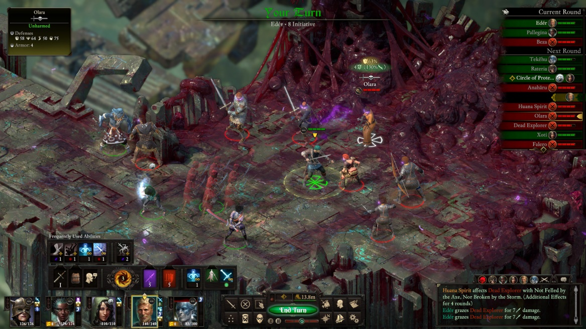

  Prácticamente todas las acciones del juego vienen determinadas por la
  tirada de uno o varios dados. Por ejemplo, que el ataque será de una
  potencia u otra dependiendo del número obtenido en este o que la
  probabilidad de poder realizar una acción sea una u otra dependiendo
  de un atributo del personaje más el número del dado. En la Figura 3.20
  a continuación se muestra una tirada de dados para realizar una acción
  en el juego “Baldur’s Gate 3”.

  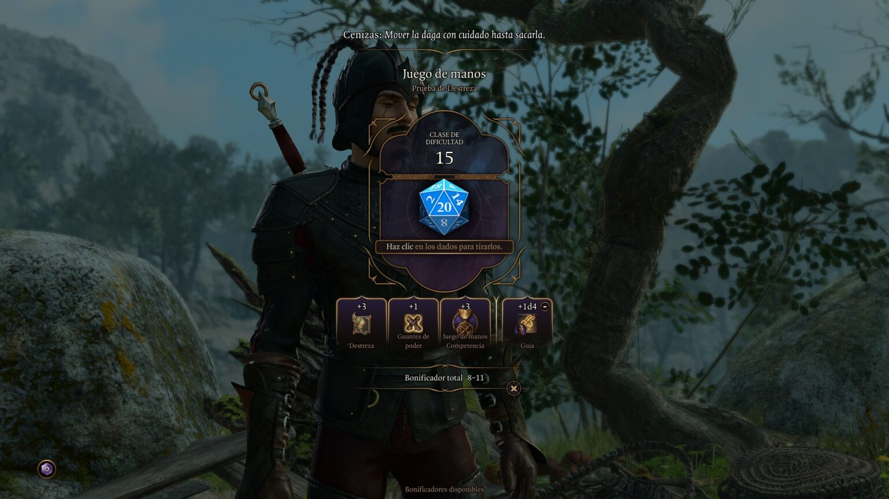

  Los CRPGs a menudo presentan sistemas de alineación y moralidad, donde
  las acciones del jugador afectan su reputación y posición moral en el
  juego. Los personajes pueden tener un tipo en concreto y puede afectar
  a las relaciones con el resto de los miembros del equipo.

  El mundo suele ser abierto o semiabierto \[ver más atrás\],
  permitiendo al jugador explorar libremente, realizar misiones
  secundarias y encontrar objetos únicos y secretos que enriquecen la
  experiencia.

  Es habitual que los juegos ofrezcan herramientas de *modding* que
  permiten a la comunidad crear contenido adicional, ampliando la vida
  útil del juego. Estos pueden personalizar su experiencia mediante la
  instalación de mods que afectan a gráficos, mecánicas y demás.

  Otra de las características principales de la mayoría de los juegos de
  este estilo es la perspectiva isométrica, aunque algunos juegos
  también presentan vistas en tercera y primera persona.

  Los juegos más representativos de este subgénero son los de la saga
  “Baldur´s Gate”, siendo su última entrega “Baldur´s Gate 3” una
  referente en este tipo de juegos. También destacan las sagas de
  “Divinity: Original Sin” y de “Pillars os Eternity”.

###  RPGs Gacha

La palabra gacha tiene relación con el término japonés “gachapon”. Se
trata de una popular máquina expendedora japonesa que, a cambio de unas
monedas, entrega una cápsula de plástico que contiene un juguete
sorpresa. Jugar en estas máquinas puede ser adictivo. Al contener
juguetes aleatorios, si quieres completar una colección, debes ingresar
tantas monedas como puedas (Tapia A., K., 2022). En la Figura 3.21 a
continuación se muestra el estilo de las cápsulas que suelen soltar las
máquinas.

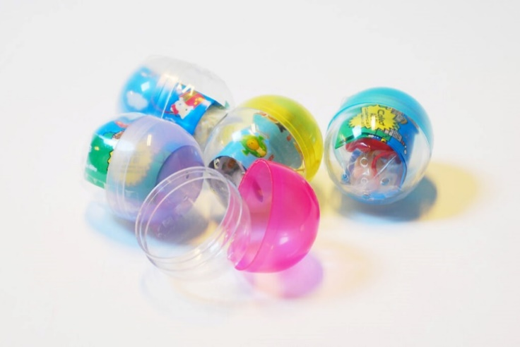

Más que un subgénero, la gacha es una mecánica. No obstante, algunos
títulos pueden ser etiquetados como juegos gacha si se centran en dicho
sistema. Este consiste en ganar elementos de manera aleatoria, ya sean
personajes, armas u objetos, realizando tiradas en diferentes máquinas
de gachapon virtuales, representadas por un *banner* dentro del juego,
utilizando la moneda virtual de este. Existen *banners* permanentes los
cuales se pueden utilizar siempre que se quiera y otros limitados que
van apareciendo y desapareciendo a lo largo del tiempo. Es posible que
el contenido de estos últimos acabes añadiéndose al del primero. En la
Figura 3.22 se muestra la pantalla para invocar personajes, con los
banners a la derecha, del juego “Black Clover Mobile”.

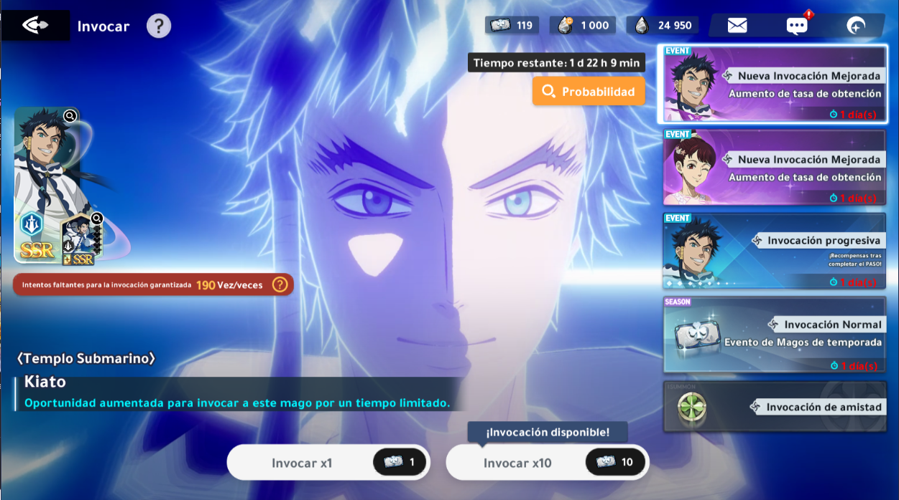

Otra característica de estos juegos es la distribución de personajes y
objetos en rarezas. Cuanto mayor sea esta, mejor será el elemento, pero
también será menor la probabilidad de obtenerlo tanto en las tiradas
como con el farmeo \[ver Mecánica de farmeo\]. También destaca la
mecánica de mejora de personajes, estos pueden subirse de nivel y
mejorar sus habilidades y equipo. Generalmente al alcanzar cierto nivel
también es posible aumentar la rareza de los elementos.

Los juegos de rol gacha suelen tener una amplia variedad de personajes
jugables, cada uno con habilidades y características únicas, y de tipos
de equipo, con características que pueden favorecer a cierto tipo de
personajes, mecánica explicada anteriormente \[ver Mecánica de
personalización de personajes\].

En cuanto a narrativa, prácticamente todos los juegos de este tipo
tienen un modo de juego con mejor o peor narrativa, que se va
desbloqueando poco a poco marcando el ritmo que debe llevar el jugador a
la hora de desarrollar el poder de los personajes. Esto se complementa
con misiones o mazmorras diarias o permanentes cuyo contenido puede
cambiar dependiendo del día o de la temporada.

La mecánica de combate en estos juegos generalmente consiste en, antes
de este, seleccionar un grupo de personajes dependiendo de sus roles,
habilidades e incluso sinergia entre ellos. Una vez elegido el equipo
que se cree adecuado, se desarrolla el combate, en tiempo real o por
turnos \[ver Combate por turnos\] donde se usan los ataques básicos y
habilidades individuales y combinadas de los personajes para derrotar a
los enemigos. También toman gran importancia las afinidades y
debilidades elementales adheridas a estos \[ver Mecánica de elementos\].
Es habitual que haya un modo arena en el que el jugador se enfrenta con
su equipo al de otro jugador, de manera simultánea online o controlado
por una IA.

Existe mucha variedad entre los juegos de rol gacha, pero algunos de los
que han destacado más a lo largo del tiempo e incluso en la actualidad
han sido “Genshin Impact”, “Honkai: Star Rail”, “Dragon Ball Legends”,
“Final Fantasy Brave Exvius”, “Seven Deadly Sins: Grand Cross”,” Pokémon
Masters EX”, etc.

##  Mecánicas comunes en los RPGs

###  Mecánica de farmeo

Una de las mecánicas más representativas en los juegos RPG es la de
farmeo, la cual consiste en derrotar enemigos más débiles para hacerse
los suficientemente fuerte para derrotar a enemigos más poderosos al
mismo tiempo que se obtienen objetos para mejorar a los personajes. Esto
crea un efecto siembra-cosecha similar al de las granjas, palabra da su
nombre a esta mecánica ya que *farm* es cómo se dice en inglés (Adell,
2014).

Uno de los principales recursos que se suele farmear en estos juegos es
la experiencia para subir de nivel a los personajes, ya que es una de
sus principales mecánicas. Se puede derrotar enemigos o cumplir misiones
para obtener estos puntos de experiencia directamente o para conseguir
objetos que permitan hacerlo. A lo largo de la historia, balancear la
obtención de este recurso ha sido una tarea compleja, ya que el abuso de
esta puede romper el juego haciéndolo demasiado fácil. En la Figura 3.23
se muestra como un personaje gana experiencia para subir de nivel tras
un combate en el juego “Pokémon: Heart Gold”.

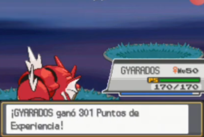

Otro recurso que se suele farmear es el equipamiento para los
personajes. Existen infinidad de formas de hacerlos como completar una
mazmorra, buscar dentro de ella directamente, derrotar jefes, derrotar
enemigos más comunes pero una cantidad mayor de veces, realizar misiones
secundarias, explorar el mundo, etc. Todo depende del tipo de juego de
rol al que se esté jugando.

Además de los anteriores, hay infinita variedad de recursos que se
pueden conseguir mediante esta mecánica como materiales para mejorar o
crear el equipamiento, para mejorar las estadísticas del personaje,
objetos para intercambiar con mercaderes u otros personajes o para
vender y obtener monedas del juego, etc. Los jugadores a menudo buscan
rutas de farmeo eficientes para maximizar las recompensas en el menor
tiempo posible. Dependiendo del tipo de juego, pueden existir eventos
multijugador-cooperativos que fomentan la obtención de recursos en
equipo.

En resumen, la mecánica de farmeo es una parte fundamental de muchos
juegos de rol, ya que proporciona a los jugadores la oportunidad de
personalizar y fortalecer a sus personajes mientras exploran el mundo
del juego.

### Mecánica de elementos

Esta mecánica se comenzó a implementar en juegos RPG medievales de
espada y hechicería, para lograr una variedad comparable entre magos y
las múltiples opciones distintas de combatientes que usan la fuerza
física o capacidad manual, como ladrones, guerreros, arqueros, etc
(Adell, 2022).

Hoy en día, la mecánica de elementos consiste en vincular uno o más
elementos a personajes o equipamiento y asociar fortalezas y debilidades
entre ellos para añadir una capa más estratégica al combate.

Los elementos básicos suelen ir asociados a fuerzas de la naturaleza
como fuego, hielo, planta, tierra, rayo, agua e incluso luz y oscuridad.
No obstante, también se han ido asociando a otros conceptos para
adecuarlos al contexto del juego o para poder vincularlos a personajes
que no usan magias. Por ejemplo, en “Seven Deadly Sins: Grand Cross”
solo existen tres y son fuerza, vida y velocidad o en “Honkai Star Rail”
son cuántico, físico, fuego, hielo, imaginario, rayo y viento. Se puede
poner el nombre que se quiera siempre y cuando se determine con claridad
las fortalezas y debilidades entre ellos, cosa que suele hacerse con una
rueda elemental como se muestra en la Figura 3.24.

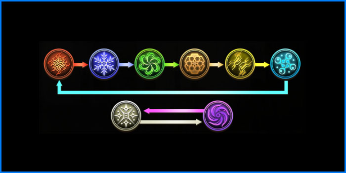

Cada elemento suele ser fuerte contra uno o varios elementos al mismo
tiempo que débil contra otro u otros, es decir, dependiendo del
enfrentamiento entre estos, los ataques realizarán más o menos daño y
del mismo modo se recibirá más o menos daño. Un elemento suele ir
asociado a un color y a un símbolo para que sea más fácil identificarlo
y representarlo dentro del juego.

Esta mecánica también da pie a incluir otra como la de efectos de
estado. Por ejemplo, si se ataca con un personaje u ataque de rayo,
puede provocar parálisis en el enemigo, de fuego, quemaduras, de hielo,
congelación, etc.

Como se ha mencionado, el uso de esta mecánica en el juego se utiliza
para dar más profundidad al combate y, por ende, a otras mecánicas
relacionadas con esta como la de formación de equipo \[ver Mecánica de
formación de equipo\] ya que, dependiendo de los elementos de los
enemigos, el jugador debería seleccionar unos u otros personajes para
que le sea menos complicado derrotarlos.

# 

# Aplicación práctica

Tras el estudio de las diferentes mecánicas que pueden llegar a formar
parte de un videojuego RPG, se ha decidido aplicar esta información en
la realización de una plantilla que aporta las bases de un juego de rol
para un jugador desarrollado en Unity. Se trata de un RPG donde se sigue
la historia de un personaje, donde la toma de decisiones puede afectar
el transcurso del juego, donde se van reclutando aliados y añadiéndolos
al equipo para enfrentar a diversos enemigos en combates por turnos y
donde se puede obtener objetos y equipamiento para mejorar a todos los
personajes. De esta manera, se podría cambiar la temática, el estilo del
arte, la historia y demás componentes nombrados anteriormente para crear
una diversa variedad de juegos RPG, pero con sus mecánicas esenciales.

En este apartado se explicarán todas las mecánicas que se han incluido
en la aplicación, ya sean propias de los RPG o de cualquier tipo de
videojuego. Se profundizará en su diseño, por qué se ha escogido esa
mecánica y cómo encaja dentro del juego, y su desarrollo, una aclaración
de cómo funciona y, si se cree necesario, la indagación en el código de
algunas partes.

##  Mecánica de diálogos

###  Diseño

Una de las partes más importantes de casi todos los juegos RPG es la
narrativa, una buena historia que incite al usuario a seguir
descubriendo la trama y que, acompañado de las demás mecánicas, le
enganche.

La base de juego desarrollada para este trabajo también consta de
narrativa, la cual se centra en Zindrael, un personaje que deberá ir
derrotando enemigos y haciendo aliados para tomar venganza de la muerte
de su esposa. Esta fue diseñada por Ignacio Calles y se explica más
detalladamente en su proyecto \[ver Narrativa interactiva en videojuegos
mediante toma de decisiones en Bibliografía\].

Hay muchas maneras de presentarla como con cinemáticas, diálogos,
exploración del mundo, misiones secundarias, objetos como libros o
grabaciones con historia, flashbacks, un narrador, etc.

En este caso se ha decidido hacerlo mediante diálogos de diferentes
tipos:

- **Narrador**: va contando la historia o los sucesos que ocurren y no
  se pueden ver. En la Figura 4.1 y Figura 4.2 se muestra cómo
  aparecerían en el juego.

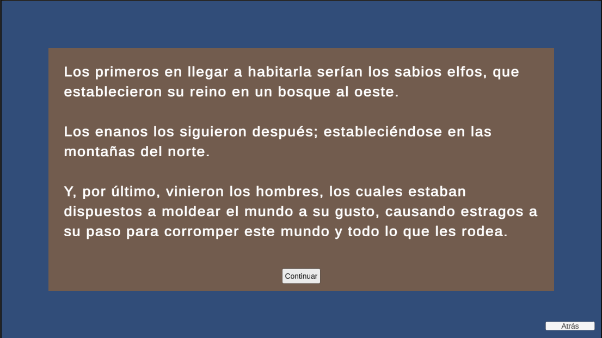

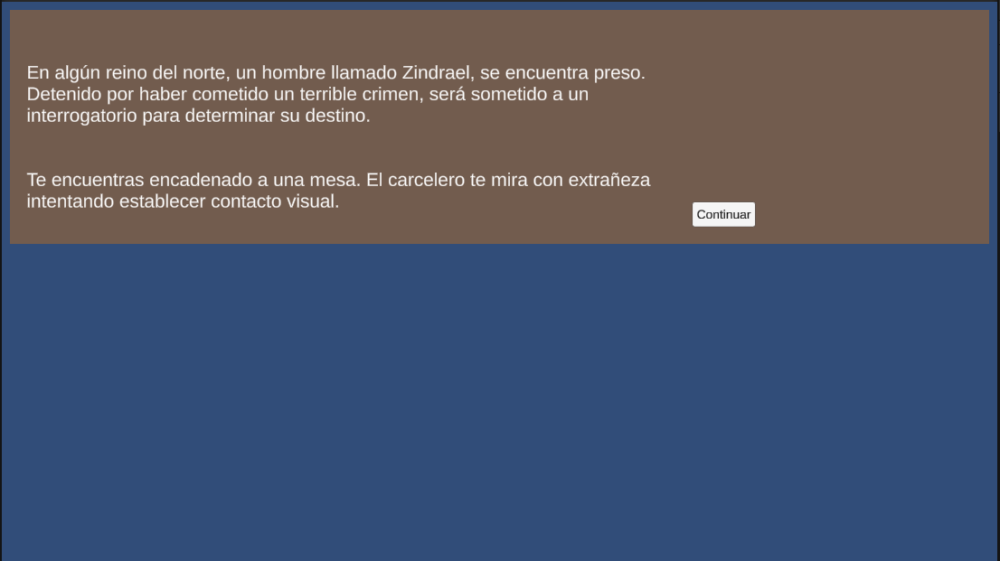

- **Diálogos normales**: dos o más personajes hablan entre sí.

- **Diálogos interactivos**: el jugador debe clicar una respuesta, a
  veces entre varias opciones, como representación del protagonista. La
  elección puede afectar al desarrollo de la historia creando una
  narrativa emergente. En la Figura 4.3 se muestra un diálogo con dos
  opciones de respuesta.

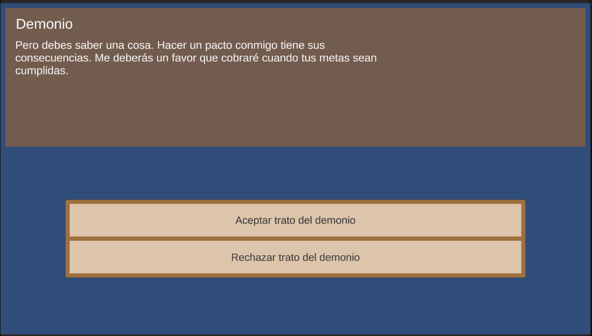

###  Desarrollo

Para el desarrollo de esta mecánica se ha usado un *asset* de Unity
llamado “Dialogue System” creado por “Pixel Crushers”. El funcionamiento
de este consiste en crear una base de datos de conversaciones y actores
para ir reproduciéndolas en la escena según convenga mediante un canvas
el cuál se muestra en la Figura 4.4.

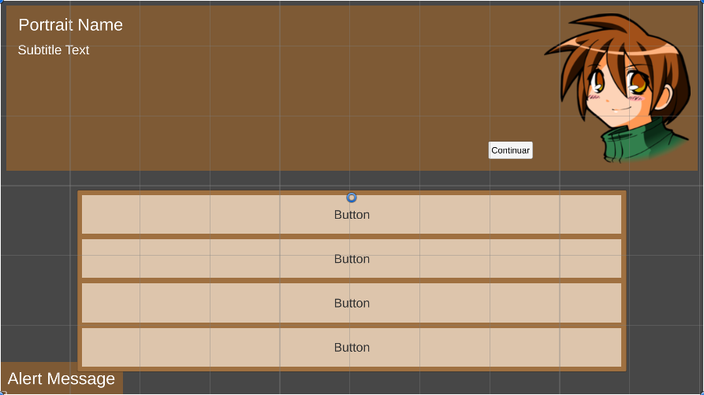

Estas conversaciones están formadas por nodos (los cuales se pueden
programar para ejecutar alguna función o para derivar el camino de la
conversación por un lado u otro según la respuesta. En la Figura 4.5 se
muestra el árbol de nodos de una conversación y el inspector de uno de
ellos.

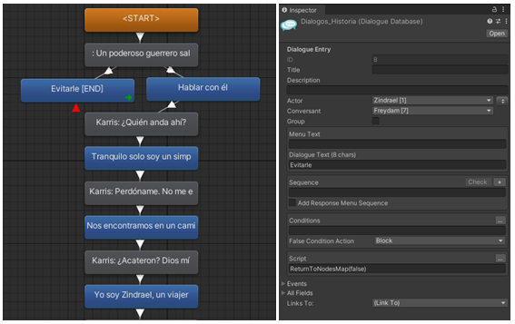

##  Mecánica de formación de equipo

###  Diseño

Como se ha explicado anteriormente \[ver Mecánica de formación de
equipo\] esta mecánica es muy habitual en los juegos RPG. En casi todos
se presenta de la misma manera, una pantalla con una formación de
equipo, en un orden concreto o no, representada por unos huecos donde se
puede clicar o arrastrar un personaje hasta ahí para seleccionarlo.

En este caso, se muestra a la derecha de la pantalla la formación del
equipo, un rectángulo vertical de tres filas por dos columnas de
espacios para añadir personajes, representando las posiciones que se
utilizarán en los combates. A la izquierda, otro espacio rectangular
donde se encuentran todos los personajes disponibles para equipar y para
hacerlo, estos se arrastran hasta las casillas vacías u ocupadas de la
parte derecha. Se puede apreciar en la Figura 4.6.

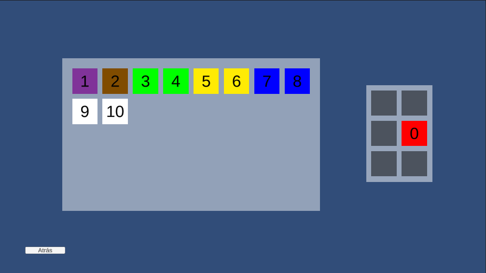

Se pueden equipar hasta cuatro personajes en la formación de seis, si se
intenta añadir uno más en un hueco vacío, se devuelve al inventario y si
se coloca un personaje encima de otro, se intercambian. Es importante el
orden en la formación ya que en el combate los ataques básicos van
dirigidos primero a los de la fila de delante.

Una vez se haya decidido la formación, se puede volver a la pantalla
anterior dando al botón de “Atrás” guardando así los cambios realizados.

###  Desarrollo

Esta mecánica se desarrolla en su propia escena de Unity con un canvas
donde se muestran el inventario de personajes y la formación del equipo.
El primer componente nombrado es un panel en el que se puede deslizar
para ver su contenido y el segundo es otro panel con seis objetos
representando casillas.

Los objetos nombrados antes y los que representan a los personajes
tienen un script se encargan del correcto funcionamiento de arrastrar
unos elementos en otros. Además, estos últimos tienen adheridos también
su propio script con la clase personaje.

El código de los personajes que se encarga de esto, mostrado en la
Figura 4.7, contiene las funciones “OnBeginDrag”, “OnDrag” y
“OnEndDrag”. Mediante los eventos del ratón de clicar, arrastrar y
soltar el objeto, realizan diferentes acciones. Así miso, el del
inventario y las casillas de formación contienen la función “OnDrop”,
mostrada en la Figura 4.8, que realiza acciones si se suelta el elemento
arrastrado en el objeto que la contiene.

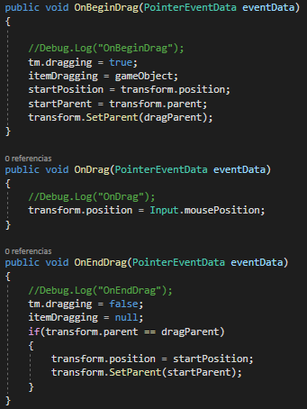

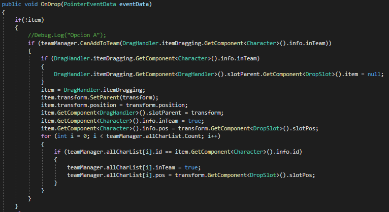

Por ejemplo, a la hora de añadir un personaje a la casilla de la
formación, se comprueba si el equipo ya contiene cuatro integrantes si
la casilla está vacía, si no es así, se cambia la posición del objeto y
se añade la información del personaje a una lista que representa el
equipo. Si la casilla no estuviese vacía, simplemente se elimina de la
lista la información del objeto que vuelve al inventario y se añade la
del nuevo.

Cuando ya se ha decidido el equipo, al darle al botón de atrás, se
guarda la lista con la información de los personajes que se quiere
conservar en un script general, que está presente en todas las escenas
del juego, para su posterior uso además de en un JSON para la
persistencia del juego. Se hace mediante la función “SaveTeam” mostrada
en la Figura 4.9.

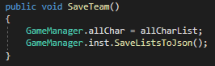

##  Mecánica de información del personaje

### Diseño

La mayoría de RPGs tienen varios personajes jugables y todos ellos
tienen diferentes características como su trasfondo narrativo, sus
ataques, sus habilidades especiales, su imagen o modelo y animaciones,
el elemento que tienen designado, el tipo de arma que utilizan, etc.

Es habitual que toda esta información aparezca en una pantalla,
accesible al clicar sobre un personaje desde un inventario de estos. En
este caso, se va a acceder de la misma manera, desde una zona que se
denomina “Taberna”, cuyo funcionamiento se explicará más tarde \[ver
Mecánica de mapa de nodos\], se podrá acceder al inventario de
personajes, mostrado en la Figura 4.10.

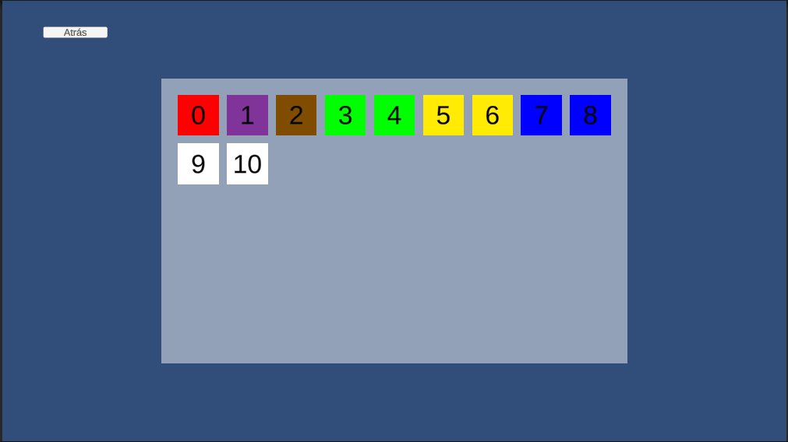

Clicando encima de cualquiera de ellos aparecerá otra pantalla con su
información. A la izquierda en un recuadro, de arriba abajo, se muestra
su nombre, su nivel, su elemento o tipo, su estilo de arma, su ataque o
habilidad especial y sus estadísticas de ataque, defensa y vida. En
medio de la pantalla, aparece la imagen del personaje junto con dos
botones para acceder a las mecánicas de equipamiento \[ver Mecánica de
equipamiento\] y de subir nivel \[ver Mecánica de subir nivel\] del
personaje, y en un recuadro a la derecha aparece una descripción
narrativa de este. Esto se puede apreciar en la Figura 4.11.

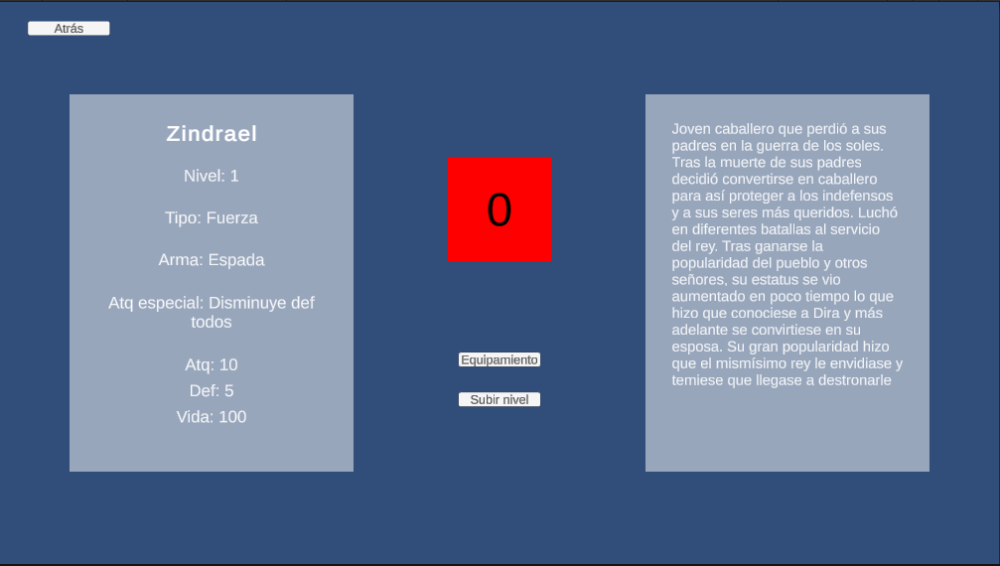

###  Desarrollo

Esta mecánica consta de varias escenas. La de la taberna contine un
canvas con varios botones, uno de ellos el del inventario de personajes
que, al clicarlo cambia a su escena correspondiente. Una vez ahí, en un
panel en mitad de la pantalla con un *grid layout*, con función de
deslizamiento si fuese necesario, se instancian todos los personajes que
se tiene disponible desde una lista de estos. En realidad, se extrae la
información necesaria de cada uno de la lista y se copia en un prefab
propio de esta escena que es el que se instancia más tarde. Se hace
mediante la función “CharInventory” mostrada en la Figura 4.12.

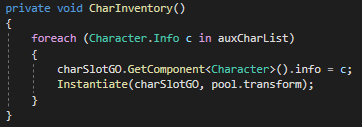

Al clicar en el personaje del que se quiere saber la información,
mediante un evento de ratón se realiza la función “OnPointerClick”,
mostrada en la Figura 4.13, que guarda el id de este, variable
perteneciente a la clase del personaje, para poder acceder a su
información a continuación y cambia a la siguiente escena.

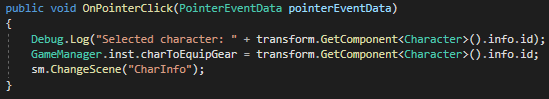

Una vez se abre la escena de información del personaje, se accede al id
que se ha guardado antes y se obtiene la información relacionada a este
para poder mostrarla por pantalla mediante textos y otro tipo de
objetos.

##  Mecánica de subir nivel

###  Diseño

La mecánica de subir nivel es otra de las imprescindibles para casi
cualquier juego RPG. Generalmente, se utiliza para equilibrar el nivel
de dificultad del juego y para añadir esa sensación de evolución y
personalización de personaje \[ver Mecánica de personalización de
personajes\].

Existen diversas formas de subir el nivel de un personaje, las más
comunes son ganando experiencia tras un combate y mediante objetos. En
este caso, se ha implementado la segunda opción.

Desde la pantalla de información del personaje \[ver más atrás\],
mediante un botón, se accede a la pantalla de subir nivel. Como se ve en
la Figura 4.14, a la izquierda, se puede observar el nivel actual del
personaje, la barra de experiencia necesaria para alcanzar el siguiente
nivel y los objetos que se pueden seleccionar para dárselos a este. A la
derecha, la imagen del personaje, sus estadísticas básicas de ataque,
defensa y vida, la cantidad de monedas que va a costar realizar la
acción de subir nivel y el botón para hacerlo. Además, arriba a la
derecha se muestra la cantidad de monedas que tiene el usuario.

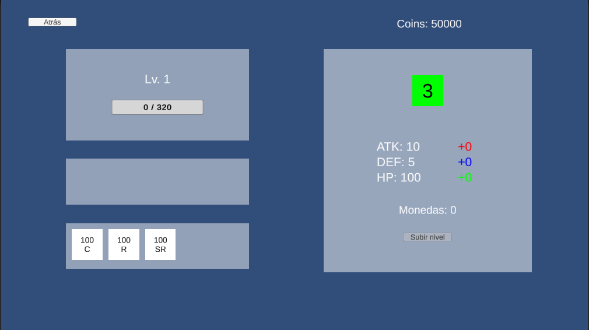

Clicando encima de los objetos, se seleccionan, moviéndose al espacio
libre de arriba de donde están situados, para ser usados añadiendo la
experiencia que aportan cada uno a la barra y la cantidad de monedas
necesarias. Los objetos comunes “C” otorgan 50 de experiencia, los raros
“R” otorgan 150 y los super raros “SR” otorgan 350. Los objetos pueden
volver a deseleccionarse volviendo a clicar en ellos.

Por cada objeto que se usa, el coste aumenta en 60 monedas si el
personaje está al nivel 35 o menos, 80 monedas si está entre el nivel 35
y el nivel 70 y, 100 monedas, si está por encima del nivel 70.

Cuando los objetos seleccionados aportan suficiente experiencia como
para subir un nivel o más, el número que lo representa aumenta y se
previsualiza, a la derecha de las estadísticas básicas, la cantidad que
se sumaría a cada una de estas. Esto se aprecia en la Figura 4.15 a
continuación.

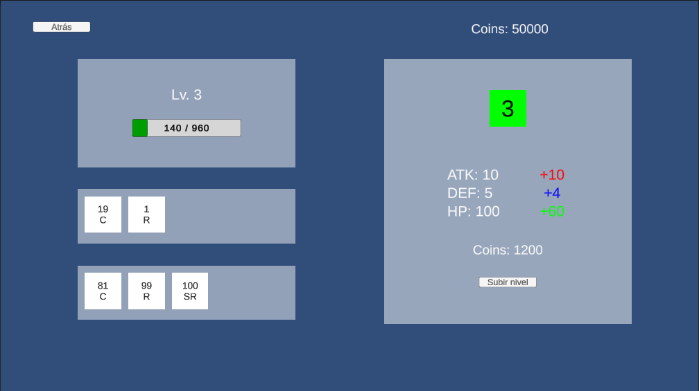

Una vez se ha seleccionado al menos un objeto de subir nivel, se puede
clicar el botón de la derecha correspondiente, se restarán las monedas
requeridas del monedero del usuario si la cantidad necesaria no
excedieran estas (en tal caso, el texto de las monedas cambiaría a color
rojo y no se activaría el botón), y se actualizará el nivel y las
estadísticas básicas del personaje si fuese necesario.

###  Desarrollo

Esta mecánica también se desarrolla en su propia escena a la cual se
accede desde un botón situado en la de información del personaje \[ver
Mecánica de información del personaje\]. Prácticamente todos los
elementos se presentan en esta en un canvas, dentro de paneles, mediante
textos (nivel, estadísticas, monedas), una *slider* (barra de
experiencia), instancias de objetos (ítems para subir nivel), botones,
etc.

Al clicar sobre un objeto de subir nivel, si no estaba seleccionado ya,
se aumenta la cantidad de una variable que guarda cuantos objetos de esa
rareza sí lo están y se llama a la función “UpdateExp”, mostrada en la
Figura 4.16, que actualiza el valor de la slider, que representa la
barra de experiencia, y calcula y actualiza las variables que guardan la
cantidad de estadísticas que se le podrían sumar al personaje si se
subiera nivel. También a otra que actualiza la cantidad de monedas
necesarias para realizar la acción de subir nivel.

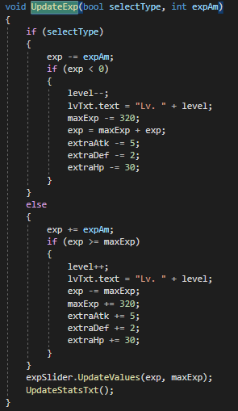

Una vez se han seleccionado todos los objetos, se puede clicar el botón
si la cantidad de monedas necesarias no excede las propias del usuario.
Al hacerlo, se ejecutan dos funciones. “LvlUp”, mostrada en la Figura
4.17, que destruye los objetos seleccionados que se han usado para subir
nivel, suma a las estadísticas básicas del personaje las aumentadas por
subir un nivel o más y actualiza la cantidad de monedas del usuario
además de reiniciar los valores que sean necesarios para poder volver a
realizar la acción. La otra, guarda toda la información actualizada de
los objetos de subir nivel y estadísticas del personaje para la
persistencia del juego.

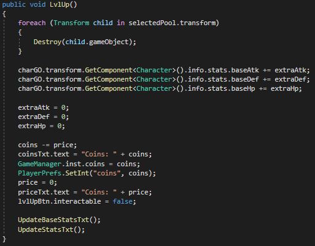

##  Mecánica de equipamiento

###  Diseño

La mecánica de equipamiento de personajes es esencial para cualquier
juego de rol ya que aporta una dinámica de progreso a lo largo del
juego, presenta la posibilidad de hacer diferentes tipos de builds
dependiendo de la evolución del personaje \[ver Mecánica de
personalización de personajes\] y complementa a otras mecánicas como la
de farmeo \[ver Mecánica de farmeo\].

En esta aplicación práctica, esta mecánica se presenta en una pantalla a
la cual se accede desde la de información del personaje \[ver Mecánica
de información del personaje\]. Como se muestra en la Figura 4.18, a la
izquierda se presenta un recuadro con dos pestañas, una de armas y otra
de armadura; a la derecha, la imagen del personaje con seis casillas
para equipar armadura, las estadísticas básicas más las que aporta el
equipamiento y otra casilla para añadir un arma.

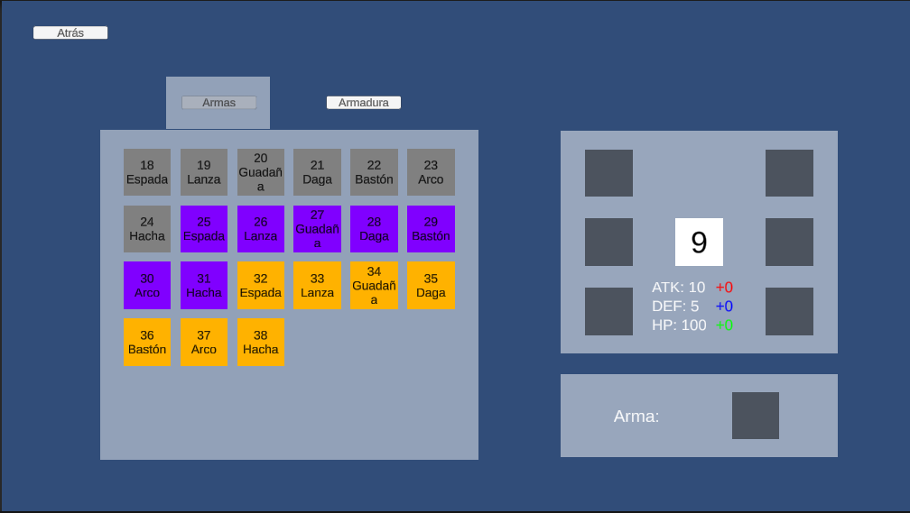

En la primera pestaña de la parte izquierda, se encuentran todas las
armas disponibles en el inventario del usuario las cuales pueden ser de
rareza común, representado con color gris, rareza rara, con color morado
y rareza súper rara, con color naranja. Las armas existentes en el juego
son espadas, lanzas, guadañas, dagas, bastones, arcos y hachas. Cuanta
mayor rareza, más estadísticas aportan al personaje. Se puede apreciar
en la Figura 4.18.

En la Figura 4.19 se aprecia cómo las armas solamente aumentan la
estadística de ataque del personaje, cada uno es más hábil con un tipo
de arma en concreto y si se le quipa la correcta aumentará la cantidad,
en cambio, si se añade cualquier otra, aumentará también, pero en menor
medida.

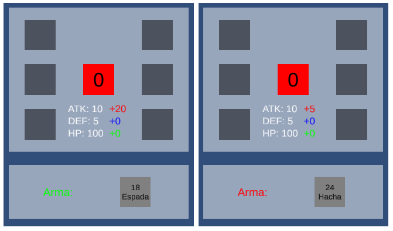

En la segunda pestaña de la izquierda mostrada en la Figura 4.20, se
accede a todas las piezas de armadura disponibles en el inventario las
cuales pueden ser de rareza común, rara o súper rara representada por
los colores gris, morado y naranja respectivamente y, dependiendo de
esta, otorgará más o menos estadísticas al personaje. Las piezas de
armadura pueden ser brazaletes, collares, cinturones, pendientes,
anillos y orbes y, dependiendo de esto, se pueden añadir a una sola
casilla de las de la derecha. Además, las piezas pueden ser de tipo
ataque (color del texto en rojo), de tipo defensa (color del texto azul)
o de tipo vida (color del texto en verde).

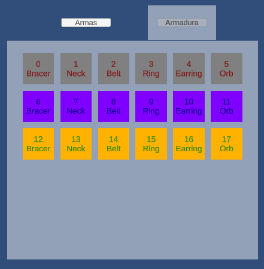

En la Figura 4.21 se muestra cómo si se quipa un brazalete o un anillo
al personaje aumentará la estadística de ataque de este, si son un
collar o unos pendientes, aumentará la defensa y si son un cinturón o un
orbe, aumentará la vida. Y en la Figura 4.22, que al equipar dos, cuatro
o seis piezas de un tipo (ataque, defensa o vida) se otorga una
bonificación sobre esa estadística.

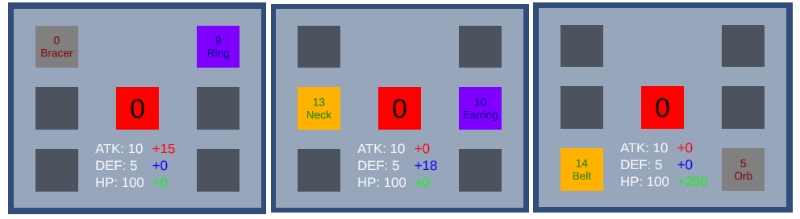

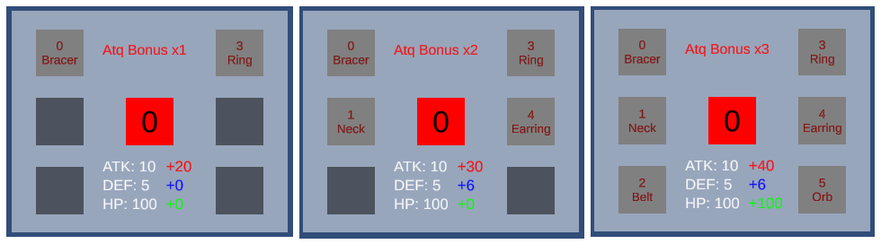

Cuando ya se han realizado las acciones deseadas, al pulsar el botón de
“Atrás”, se guardarán los cambios.

###  Desarrollo

Esta mecánica se desarrolla en su propia escena de Unity a la que se
accede al pulsar un botón situado en la de información del personaje
\[ver Mecánica de información del personaje\].

Al entrar, se instancian los objetos de la pestaña de armas ya que es la
que está activada por defecto. Cada uno tiene un script que, dependiendo
de la información que contenga la lista de la que se obtienen, les
otorga un color y un nombre además de copiar el resto de información
necesaria. Para cambiar de pestaña, se pulsa en el botón de “Armadura”
que destruye los objetos del panel e instancia los de la lista de
inventario de armadura. Estos objetos también tienen un script que los
inicializa dependiendo de la información de cada uno en la lista de la
que provienen.

Al arrastrar un objeto de pieza de armadura a su casilla
correspondiente, esta lo detecta y llama a la función “UpdateStatGear”
que se encarga de actualizar la variable que guarda la cantidad de
piezas de armadura de ese tipo (ataque, defensa o vida) que están
equipadas y llama a las funciones “UpdateBonusTxt” y “UpateCharStats”.

“UpdateBonusTxt”, se encarga de chequear si hay que aplicar una
bonificación de tipo de armadura mediante el uso de otra función llamada
“CheckBonus”. Ambas son mostradas en la Figura 4.23. Esta comprueba el
valor de una variable donde se guarda la cantidad de objetos del mismo
tipo y dependiendo de esta, activa o cambia el texto de bonificación
mediante la función. “ChangeStatBonusCount” y aumenta las estadísticas
del atributo relacionado con “AddSubtractStats”. Esto se puede apreciar
en la Figura 4.24.

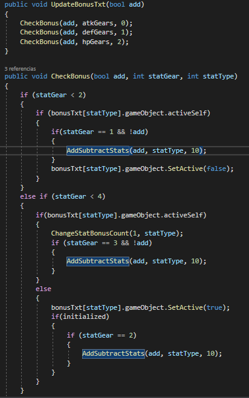

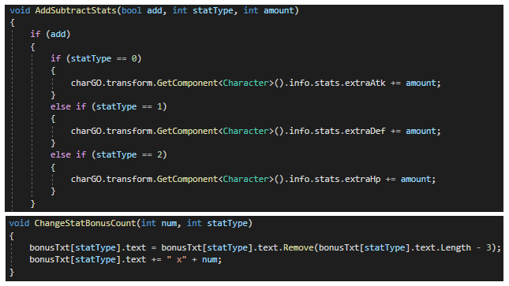

“UpateCharStats”, mostrada en la Figura 4.25, se encarga de identificar
qué nombre de pieza tiene el objeto para añadir, o quitar si se está
desequipando, la cantidad de estadísticas correspondiente a los
parámetros relacionados. Esta también se llama al equipar o desequipar
un arma (“ginfo.objType \> 5” en la Figura 4.25).

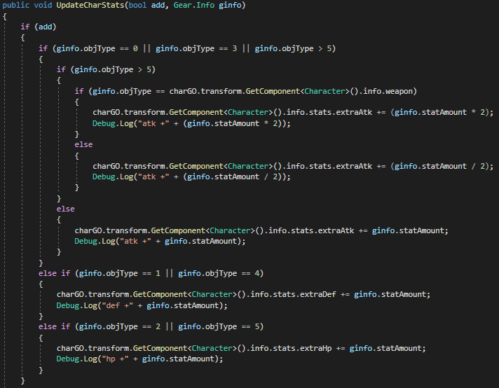

Una vez realizadas las acciones deseadas, al pulsar el botón de “Atrás”,
se ejecuta una función que actualiza la lista de inventario de
equipamiento y la nueva información del personaje con los objetos que se
le han añadido.

##  Mecánica de mejora de equipamiento

###  Diseño

Esta es otra mecánica muy recurrente en los juegos de rol, aunque no
aparece en todos. En este caso, se ha decidido implementarla ya que
enriquece en enormemente la mecánica de equipamiento \[ver Mecánica de
equipamiento\]. Narrativamente hablando en este juego, los que mejoran
el equipamiento son herreros.

A la pantalla donde se mejora el equipamiento se accede desde un nodo
del mapa \[ver Mecánica de mapa de nodos\]. En la Figura 4.26 se muestra
que la parte izquierda es exactamente igual que la de la pantalla de
equipamiento, con un panel con dos pestañas donde se intercambia entre
armas y piezas de armadura, todas presentes en el inventario. En la
parte de arriba a la derecha, se ven tres cantidades de recursos
necesarios para mejorar a un personaje, materiales de mejora, materiales
de despertar y monedas. Debajo, un recuadro donde al clicar en un objeto
de los nombrados anteriormente, se muestran los siguientes datos u
objetos además de su imagen:

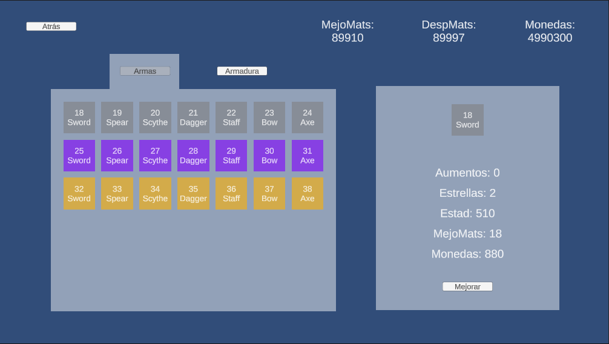

- **Botón de mejora/despertar**: se pulsa para realizar la acción de
  mejorar o despertar el equipamiento. Está activo si se dispone de los
  materiales necesarios y se desactiva en caso contrario o cuando el
  objeto está al máximo. Estos cambios se aprecian en la Figura 4.27.

- **Materiales de mejora**: recursos necesarios para poder aumentar en 1
  los aumentos del objeto. Su texto aparece en rojo si la cantidad para
  realizar la acción es insuficiente.

- **Materiales de despertar**: recursos necesarios para poder aumentar
  en 1 las estrellas del objeto. Solo aparecen cuando el número de
  aumentos ya está al máximo y es necesario despertar el objeto. Su
  texto aparece en rojo si la cantidad para realizar la acción es
  insuficiente.

- **Monedas**: cantidad de estas necesarias para mejorar o despertar el
  equipamiento.

- **Estadísticas**: número que aumenta la estadística del personaje
  relacionada con el objeto. Por ejemplo, si es un arma, el ataque, y si
  es un cinturón, la vida. Estas crecen en función del número de
  aumentos y estrellas.

- **Aumentos**: número que aumenta de 0 a 5, se puede sumar uno si se
  dispone de suficientes materiales de mejora y monedas y el número de
  estrellas sea menor de 5. Cada vez que ocurre, aumentan las
  estadísticas que aporta el equipamiento. Al llegar a 5, se puede
  despertar el objeto para que se sume 1 al número de estrellas y se
  reinicien los aumentos a 0.

- **Estrellas**: número que aumenta de 0 a 5, se puede añadir una cada
  vez que el número de aumentos sea 5 y se dispongan de suficientes
  materiales de despertar y monedas.

Una vez se han realizado las acciones deseadas, se pulsa el botón de
“Atrás” para guardar los cambios en la lista de equipamiento del
inventario y para volver al mapa de nodos.

###  Desarrollo

Esta mecánica se desarrolla en su propia escena del proyecto, a la cual
se accede desde otra escena iniciada desde el mapa de nodos \[ver
Mecánica de mapa de nodos\]. Al iniciarse, se instancian todos los
objetos de la pestaña de armas que viene activada por defecto igual que
en la mecánica de equipamiento \[ver más atrás\] y se inicializan los
datos de los textos de los recursos además de obtener y guardar la lista
de equipamiento.

Al clicar en uno de los objetos, se llama a una función que actualiza la
información de la derecha con la de este y llama a la función
“CanUpAwGear”, mostrada en la Figura 4.28, la cual, mediante los
parámetros de entrada y otras variables, comprueba si los recursos
disponibles para realizar la acción son suficientes, cambia el texto de
estos a rojo si no lo son y activa o desactiva el botón según los
resultados.

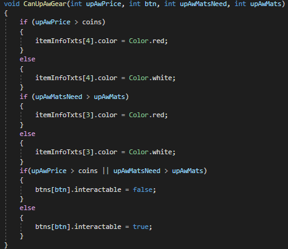

Si el botón se ha activado y se pulsa, se llama a la función
“UpgradeAwakeGear”, mostrada en la Figura 4.29. Esta comprueba si el
número de aumentos ya es 5, si es así, los reinicia a 0, aumenta el
número de estrellas en 1 y actualiza el número de recursos disponibles.
Después, comprueba si el número de estrellas ya es 5 y, si lo es,
desactiva el botón, pero si no lo es, actualiza la variable bool
“upgrade” del objeto a *true*, que indica que es posible mejorarlo en
función de sus estrellas y aumentos, y actualiza el botón a su estado
correspondiente llamando a “CanUpAwGear”.

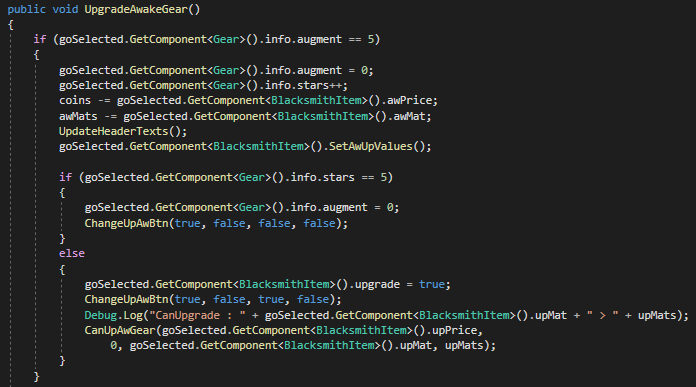

Si el número de aumentos no es 5, le suma 1, incrementa el número de
estadísticas que aporta el objeto en función de su tipo (5 – brazalete o
anillo, 3 – collar o pendientes, 5 – cinturón u orbe, 10 – arma)
mediante una función y actualiza el número de recursos necesarios para
poder volver a mejor el equipamiento según su nuevo número de aumentos y
estrellas y de su rareza con la función “SetAwUpValues” (Figura 4.30).

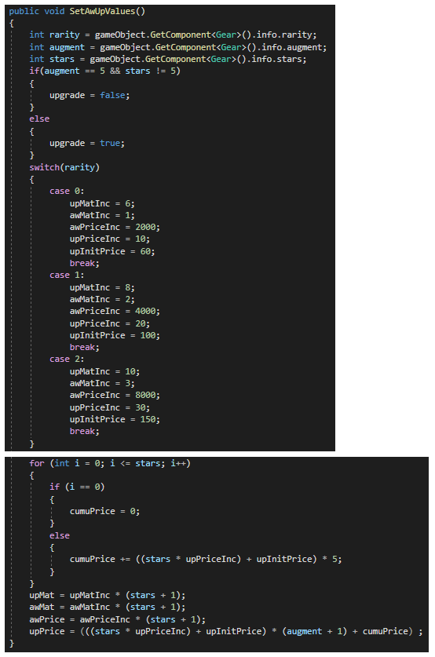

Después, realiza las mismas comprobaciones nombradas anteriormente de si
el número de estrellas ya era 5 o no y guarda los cambios realizados al
objeto en la lista de equipamiento del inventario.

##  Mecánica de comerciar equipamiento

###  Diseño

La mecánica de comercio ya no es que sea propia de cualquier juego RPG,
si no que está presente en la mayoría de los videojuegos de uno u otro
modo. Es una manera de gastar los recursos obtenidos a lo largo de estos
o de obtenerlos en el caso de que fuese necesario. Narrativamente
hablando, en este juego los que te compran y venden equipamiento son
mercaderes.

A la pantalla donde se mejora el equipamiento se accede desde un nodo
del mapa \[ver Mecánica de mapa de nodos\]. A la izquierda, como en
otras mecánicas descritas anteriormente, se muestra un recuadro cuyo
contenido cambia en función de la pestaña que esté activa. Si la de
“Comprar” lo está, se mostrarán una serie de piezas de armadura y armas
que cada mercader tendrá disponible para vender. Si la que está activa
es la de “Vender”, se mostrarán todos los objetos de equipamiento, no
equipados en ningún personaje, que se encuentren en el inventario del
usuario.

En la Figura 4.31 se aprecia, en la parte de arriba a la derecha, las
monedas disponibles del usuario y debajo, otro recuadro donde aparece la
imagen del objeto seleccionado, su rareza (0 – común, 1 – raro, 2 –
súper raro), las estadísticas que aporta el objeto al ser equipado, las
monedas que cuesta en caso de pertenecer a la pestaña de “Comprar” o las
que va a obtener el jugador en caso de hacerlo a la de “Vender” y el
botón para realizar la acción de comprar o vender según corresponda.

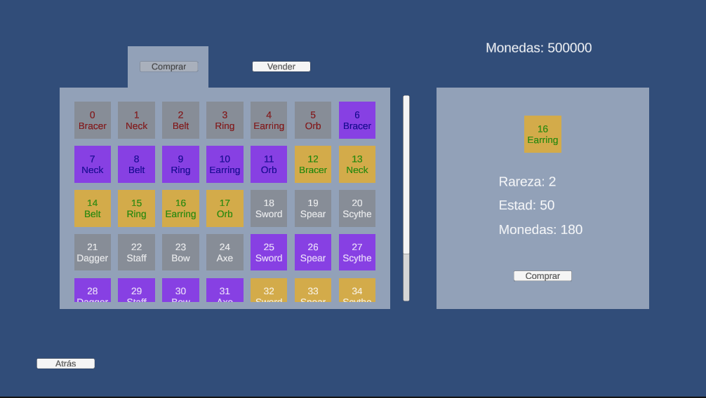

Al clicar sobre uno de los objetos de la izquierda, se actualiza la
información del recuadro de la derecha y en el caso de que se quiera
comprar, si no se dispone del número de monedas suficiente, el texto de
estas se pondrá en rojo y se deshabilitará el botón, como se muestra en
la Figura 4.32. Si se dispone de los recursos, al pulsar el botón, se
restarán las monedas que haya costado, se limpiará la información del
recuadro y se añadirá el objeto al inventario del usuario, así como
desaparecerá de la pestaña de “Comprar”. Del mismo modo, si la acción es
vender, desaparecerá del inventario del jugador, sin añadirse al del
comerciante y se sumarán al jugador las monedas indicadas con
anterioridad.

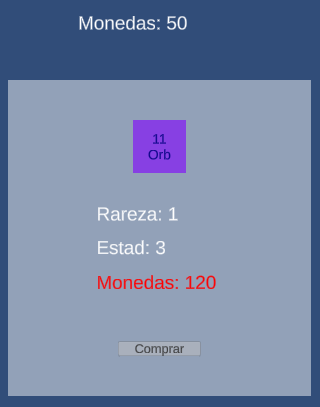

Una vez realizadas todas las acciones deseadas, se puede pulsar el botón
de “Atrás” para volver al mapa de nodos.

### Desarrollo

Esta mecánica se desarrolla en su propia escena de Unity a la cual se
accede desde otra escena iniciada desde el mapa de nodos \[ver Mecánica
de mapa de nodos\]. Al iniciarse, se instancian los objetos de la
pestaña que está activa, por defecto la de “Comprar”. Actualmente, se
crean unos objetos cualesquiera en el inventario del comerciante para
poder utilizar la mecánica, pero cada uno podría tener los suyos o
propios o crearse aleatoriamente.

Al clicar en un objeto, se ejecuta la función “ChangeItemInfo”, mostrada
en la Figura 4.33, la cual obtiene la información necesaria de este y
actualiza los datos del recuadro de la derecha: la imagen, los textos
(pone en rojo el de monedas si es necesario) y el botón (activa el de
comprar o el de vender en función de que pestaña esté activa y lo
inhabilita si es necesario).

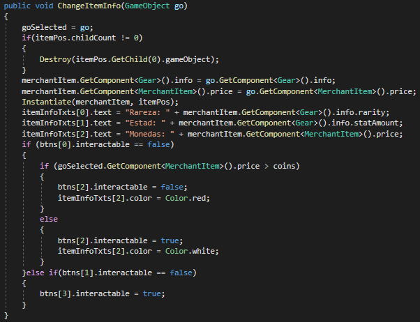

Si se pulsa el botón de “Comprar”, se ejecuta la función “BuyBtn”,
mostrada en la Figura 4.34, la cual busca el equipamiento seleccionado
en la lista de objetos disponibles para comprar, resta su precio a las
monedas del usuario y las actualiza en la interfaz, lo añade a la lista
del inventario del jugador, lo elimina de la primera lista nombrada,
reinicia los datos del recuadro de la derecha y guarda los cambios
realizados.

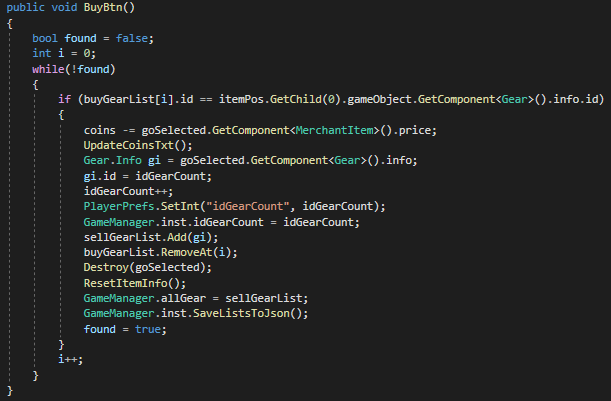

Si el objeto seleccionado es de la pestaña “Vender”, el botón activado
es el correspondiente y al pulsarlo se ejecuta la función “SellBtn”,
mostrada en la Figura 4.35, la cual busca el equipamiento seleccionado
en la lista donde se encuentra el inventario de equipamiento del
jugador, suma su precio a las monedas del usuario y las actualiza en la
interfaz, lo elimina de la lista nombrada, reinicia los datos del
recuadro de la derecha y guarda los cambios realizados.

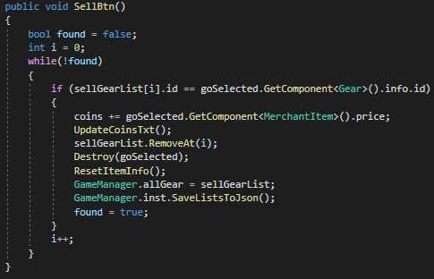

Cuando ya se han realizado las acciones deseadas, se pulsa el botón
“Atrás” que realiza una función para volver a la escena del mapa de
nodos.

##  Mecánica de combate

###  Diseño

La mecánica de combate es otra de las imprescindibles para cualquier
juego RPG. Se decidió que este sería por turnos, ya que es la forma más
versátil si no se sabe con exactitud para qué plataforma se desarrollará
el juego, y porque es el estilo más común.

Como se aprecia en la Figura 4.36, en el lado izquierdo de la pantalla
siempre van a aparecer los personajes que se han añadido en la formación
de equipo, en el orden seleccionado. A la derecha, los enemigos. Debajo
de todos y cada uno de estos se pueden ver dos barras, la verde es la
que representa la vida de cada uno y la azul la que representa cuánto
falta para poder usar su habilidad especial.

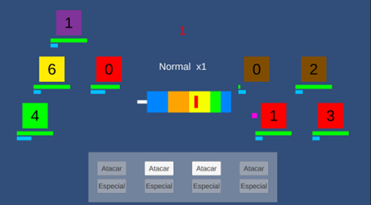

En la parte baja de la pantalla, aparecen tantos pares de botones como
personajes haya en el equipo, cada pareja está formada por un botón de
ataque y otro de ataque o habilidad especial, este último solo se
habilitará cuando la barra correspondiente se haya llenado. El ataque
básico siempre será individual, es decir el daño se realizará al enemigo
que tiene el marcador delante suyo y el ataque o habilidad especial
puede usarse tanto en enemigos como aliados y puede afectar a toda una
fila, a toda una columna, a todos o a un solo personaje. Los enemigos
también disponen de estos. Los que han sido implementados son los
siguientes:

- **Curar a todos los aliados**: aumenta la vida de todos los aliados en
  un porcentaje del ataque del lanzador

- **Curar a un aliado**: aumenta la vida de un personaje en función del
  ataque del lanzador

- **Atacar a todos los enemigos**: infringe daño a todos los enemigos en
  un porcentaje del ataque del lanzador

- **Atacar a una fila**: infringe daño a los enemigos situados en la
  misma fila en un porcentaje del ataque de lanzador

- **Atacar a una columna**: infringe daño a los enemigos situados en la
  misma columna en un porcentaje del ataque de lanzador

- **Aumenta el ataque de todos los aliados**: en un porcentaje del
  ataque del lanzador

- **Aumenta el ataque de un aliado**: en función del ataque del lanzador

- **Disminuye el ataque de todos los enemigos**: en un porcentaje del
  ataque del lanzador

- **Disminuye el ataque de un enemigo**: en función del ataque del
  lanzador

- **Aumenta la defensa de todos los aliados**: en un porcentaje del
  ataque del lanzador

- **Aumenta la defensa de un aliado**: en función del ataque del
  lanzador

- **Disminuye la defensa de todos los enemigos**: en un porcentaje del
  ataque del lanzador

- **Disminuye la defensa de un enemigo**: en función del ataque del
  lanzador

Estos *buffs* y *debuffs* sobre enemigos y aliados se muestran encima de
los personajes durante los turnos asignados mediante la abreviatura de
su estadística y una flecha roja hacia abajo o verde hacia arriba si
disminuyen o aumentan respectivamente (Figura 4.37).

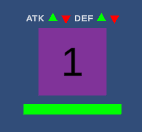

En la ronda, siempre ataca primero el usuario. Si están disponibles los
ataques o habilidades especiales lo más efectivo sería lanzarlos antes
de hacer los ataques básicos, ya que una vez se pulsa el primer botón de
ataque, los especiales se desactivan. Si hay más de un personaje en la
formación, entre ataque básico y ataque básico de estos se activa la
posibilidad de hacer un combo, mostrándose su interfaz en mitad de la
pantalla, y aumentar el daño que se hace.

La manera de hacerlo es clicar en el botón de ataque del personaje que
se quiere usar a continuación cuando el indicador en movimiento se
encuentre en una franja de la barra de combo. En la Figura 4.38 se
aprecia que las secciones de esta son “Normal” o azul, “Bien” o naranja,
“Genial” o amarillo y “Perfecto” o verde. Cuanto menos sea el sector,
más difícil será colocar el indicador en movimiento ahí pero mayor será
el aumento de daño. Además, acertar varias veces el combo entre ataques
aumenta el daño según la cantidad. De esta manera, el último personaje
en atacar es el que más daño hace.

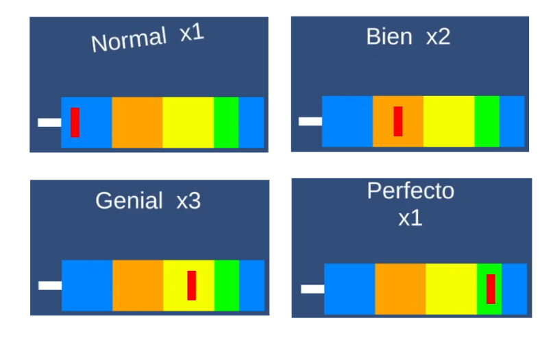

Una vez ha atacado el usuario con todos los personajes, es el turno de
los enemigos. Estos siempre atacan en el mismo orden, primera columna de
arriba abajo y segunda columna igual. La prioridad a la hora de
seleccionar el objetivo entre los personajes del usuario será el mismo
que el del orden de ataque.

El daño que realizan y reciben los personajes también puede verse
aumentado o disminuido en función de su elemento. La cantidad de este
aparece en pantalla representado por un número, si el elemento es
ventajoso, saldrá en color verde, si no tienen relación, en blanco y si
es desventajoso, en rojo. La relación entre elementos aparece en la
Figura 4.39 a continuación.

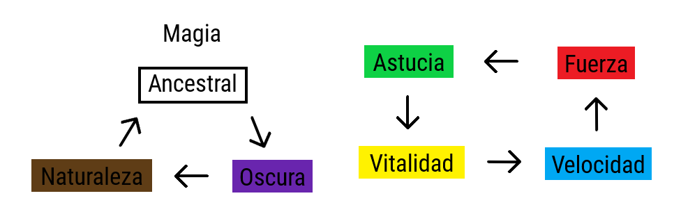

Cuando todos los enemigos o todos los aliados mueren, da por finalizado
el combate.

###  Desarrollo

Esta mecánica tiene su escena, al entrar, se instancian los prefabs con
los objetos que representan a los personajes en unas posiciones ya
determinadas en la escena, en el lugar que se ha seleccionado en la
formación. Del mismo modo, se instancian los enemigos.

La información de estos se encuentra en unas listas de personajes
definidas anteriormente en la formación de equipo para los aliados y en
otra función para los enemigos. En esta última, mostrada en la Figura
4.40, dependiendo de un parámetro de entrada que es un número, se añaden
a la lista un tipo de enemigos u otros, lo cual no se ve reflejado en el
juego ya que solo existen *placeholders* como imágenes. En la mayoría de
los combates se genera un equipo de un tipo de enemigo, con un elemento
aleatorio y una habilidad o ataque especial aleatorios. Lo ideal en un
futuro sería hacer formaciones enemigas definidas para aumentar la
dificultad del juego y que tengan más sentido otras mecánicas como la de
elementos o la de formación de equipo.

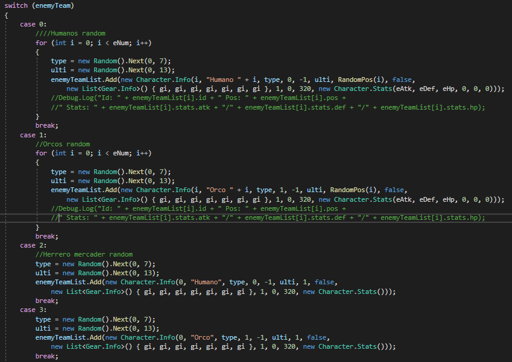

Tras esto también se instancias tantos prefabs de parejas de botones
como personajes en la formación y se conectan entre ellos para su
correcto funcionamiento. Una vez pulsado el botón de ataque, se
identifica qué enemigo es el objetivo mediante una variable de tipo int
que indica la posición del objeto y por ende su acceso. Después, se
realiza la función de ataque (Figura 4.41), que activa el combo, si
procede, junto con sus animaciones y realiza la función de daño (Figura
4.42) situada en un script en el objeto enemigo, la cual le resta vida y
lo destruye si esta llega a cero.

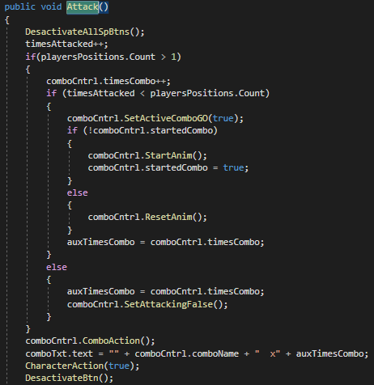

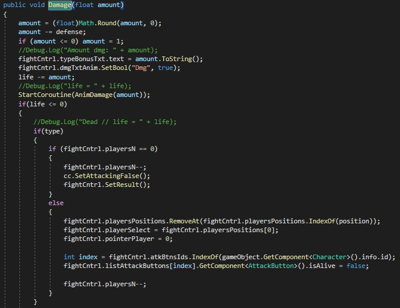

El parámetro de entrada de la función “Damage” de la determina el daño
que recibe el personaje y está formado por una función matemática con
distintas variables (Figura 4.43).

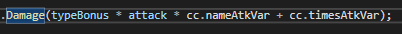

La variable “typeBonus” de la Figura 4.43 indica el daño recibido en
función del elemento del personaje. Mediante la entrada del tipo de
elemento del personaje en una función (Figura 4.44), se determina su
relación con el del atacante, si este es más efectivo, el daño de
multiplica por 2, si no tiene relación, se deja igual multiplicándolo
por 1 y si es débil, se multiplica por 0.5 para dividirlo a la mitad.

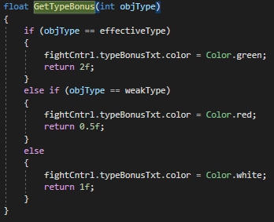

La variable “attack” es el daño de ataque del personaje, su estadística
base, dada por el nivel \[ver Mecánica de subir nivel\] de este más el
que le otorga diferente equipamiento y armas \[ver Mecánica de mapa de
nodos\]. Este a veces esta disminuido en un tanto por ciento cuando es
el que se realiza a través de los ataques especiales, por ejemplo, el de
ataque a todos los enemigos solo utiliza un 60% del ataque, como se
muestra en la Figura 4.45.

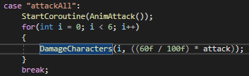

La variable “nameAtkVar” aumenta la cantidad de daño realizado en
función del acierto en el combo. Si se consigue un “Normal”, no aumenta,
si es un “Bien”, se multiplica por 2, si es un “Genial”, por 3 y si es
un “Perfecto”, por 4, como se muestra en la Figura 4.46.

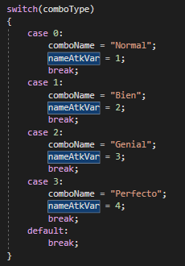

Por último, la variable “timesAtkVar” suma una cantidad de daño
dependiendo del número de veces seguidas que se acierta un combo. Si no
se acierta, no se suma nada, si se acierta dos veces, se suma 10, 3
veces, 20 y 4 veces, 30, apreciable en la Figura 4.47.

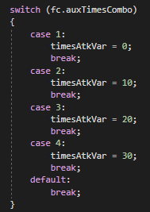

Realizando ataques normales aumenta la barra de la habilidad especial.
Cuando esta está llena, se activa el botón correspondiente y ya se puede
utilizar. El desarrollo de estos es muy similar:

- Al pulsar el botón correspondiente, se llama a la función
  “SpecialAbility”, mostrada en la Figura 4.48, que identifica el tipo
  de ataque especial mediante la variable “abilityType” que contiene el
  personaje y se llaman a otras funciones que, dependiendo del estilo de
  la habilidad, son unas u otras.

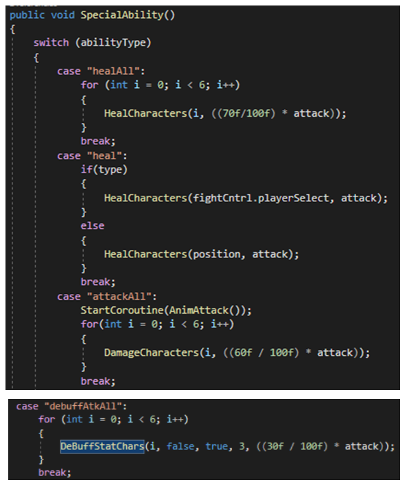

- Se llama a las funciones “HealCharacters” (Figura 4.49) si son
  curaciones, “DamageCharacters” si es daño y “DeBuffStatChars” si son
  buffs o debuffs. Lo que hacen es localizar a los personajes objetivo
  de la habilidad y realizar en ese objeto la acción final, por ejemplo,
  para los buffs o debuffs, esta se realiza en la función "DeBuffStats"
  (Figura 4.51).

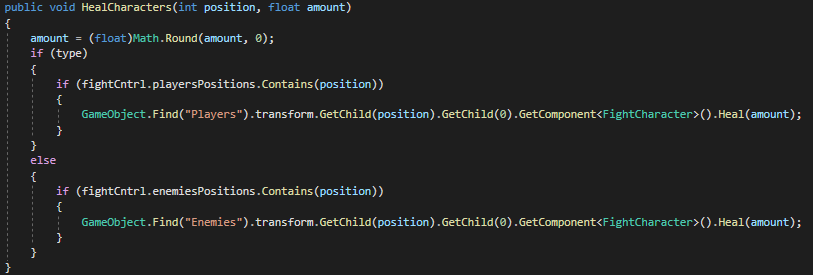

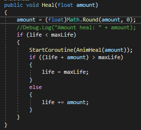

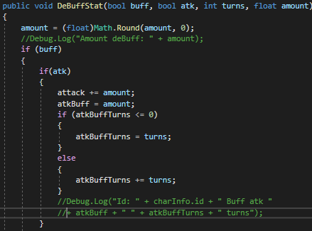

Cuando muere el último enemigo o aliado, se llama a la función
“SetResult” (Figura 4.52) que muestra el resultado y cambia a una escena
u otra según este.

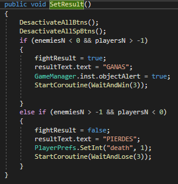

##  Mecánica de mapa de nodos

###  Diseño

Esta mecánica no es propia de todos los juegos RPG, solamente de algunos
cuya narrativa implica toma de decisiones, como es el caso. Se trata de
un mapa en el que van apareciendo diferentes caminos según va avanzando
el jugador por ellos y debe ir eligiendo cual tomar. En este caso, se ha
replicado uno creado para la historia por Ignacio Calles para su
proyecto \[ver Narrativa interactiva en videojuegos mediante toma de
decisiones\].

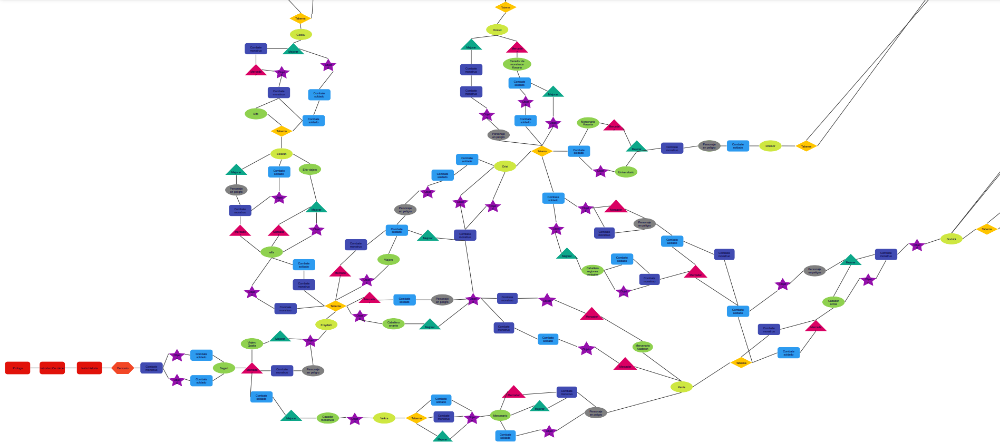

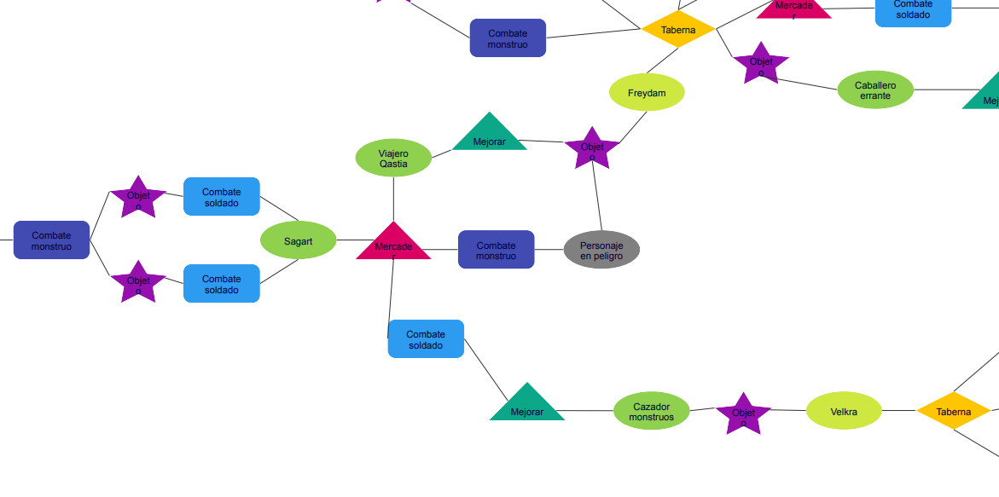

Los diferentes tipos de nodos disponibles a los que acceder y se
aprecian en la Figura 4.53 y Figura 4.54 son:

- **Combate contra monstruos o humanos**: (azul oscuro o azul claro) se
  entra en la pantalla de la mecánica de combate \[ver más atrás\].

- **Obtención de objeto**: (morado) se da al jugador de manera aleatoria
  un arma o una pieza de armadura, materiales de mejora o de despertar,
  materiales para subir nivel y monedas. Después de concluir la acción
  de cada nodo también se realiza esto. Se informa mediante el pop-up
  mostrado en la Figura 4.55.

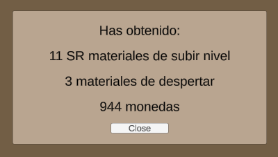

- **Diálogo narrativo**: se entra a la pantalla de diálogo y se carga la
  parte de la historia correspondiente a ese nodo \[ver más atrás\].

- **Herrero**: (azul/verde turquesa) se entra a la pantalla de diálogo y
  se da a elegir entre tres opciones, pasar de largo, mejorar el
  equipamiento o pelear con el herrero. En función de la decisión, se
  transiciona a una pantalla u otra \[ver más atrás\].

- **Mercader**: (rosa) se entra a la pantalla de diálogo y se da a
  elegir entre tres opciones, pasar de largo, comerciar o pelear con el
  mercader, como se muestra en la Figura 4.56. En función de la
  decisión, se transiciona a una pantalla u otra \[ver más atrás\].

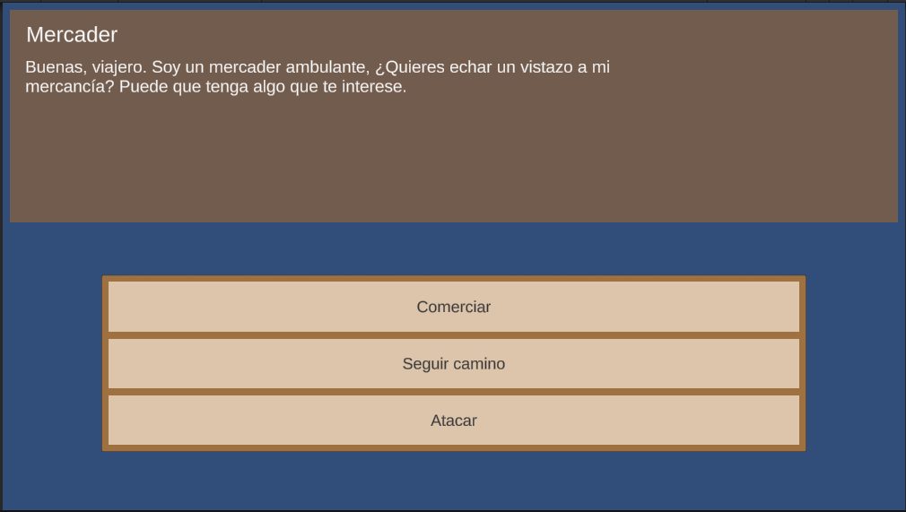

- **Evento con combate**: (gris) se desarrolla un diálogo donde un
  personaje está en peligro y después se transiciona a la pantalla de
  combate.

- **Reclutamiento de personaje** **jugable**: (verde pistacho) mediante
  la pantalla de diálogo, se anuncia un encuentro con un personaje y se
  da la opción de seguir el camino o hablar con él. Si ese escoge lo
  último, este personaje se unirá al jugador y se podrá añadir al
  equipo.

- **Taberna**: (amarillo) esta pantalla funciona como punto de control
  al que se vuelve cuando se pierde un combate. También se puede acceder
  al inventario de personajes y a la formación de equipo desde aquí.

La puesta en escena de todos estos nodos se hace mediante botones. Se
presentan en pantalla según el camino determinado por la Figura 4.53,
con un símbolo de interrogación para que el jugador no sepa de qué tipo
es cada uno y tenga que tomar una decisión (Figura 4.57). Una vez
pulsado, se realiza la acción correspondiente en la pantalla
determinada, se vuelve al mapa (salvo que se pierda un combate que se
vuelve a la última taberna visitada), se otorgan las recompensas, se
desvela el tipo de nodo que era para poder ver el camino recorrido y
aparecen la opción o las opciones siguientes a escoger.

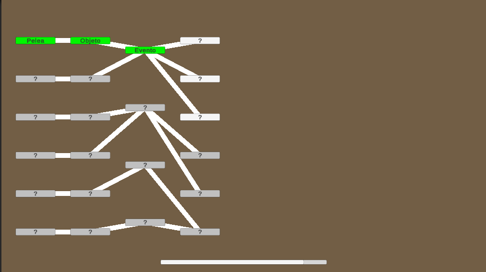

El camino se iría desarrollando pantalla por pantalla, pasando por
tabernas y avanzando en la historia hasta que se llegase a un final.
Todos los caminos y nodos han sido configurados a mano, para seguir la
historia de un modo u otro según las decisiones que se tomen.

###  Desarrollo

Esta mecánica se desarrolla en varias escenas de Unity, una por cada red
de nodos entre taberna u taberna, no obstante, todas funcionan de la
misma manera. Cada una tiene un canvas donde se añaden columnas, las
cuales contienen botones.

Al entrar en la escena por primera vez, se activa la primera columna y
se muestra los botones que contiene con el símbolo de interrogación. Al
pulsar en uno, se realizan dos funciones, “SelectNode” (Figura 4.58) y
la que transiciona a la escena correspondiente dependiendo del tipo de
nodo. La primera, actualiza el estado del nodo a “seleccionado”, cambia
el texto del botón al nombre del tipo de nodo, el color del nodo a
verde, cambia el estado del resto de nodos de la columna a no
seleccionados mediante “SetNodeSelected” (Figura 4.58) y llama la
función “ManageColumns”.

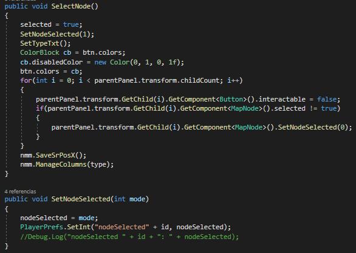

“ManageColumns”, mostrada en la Figura 4.59, aumenta en 1 la variable
“actualCol” que se encarga de llevar la cuenta de la cantidad de
columnas con nodos activas en la escena, habilita la siguiente, dibuja
las líneas desde los nodos de la anterior a la nueva, comprueba que la
nueva columna tenga algún botón en estado “se puede pulsar” y, si no,
vuelve a llamarse a sí misma.

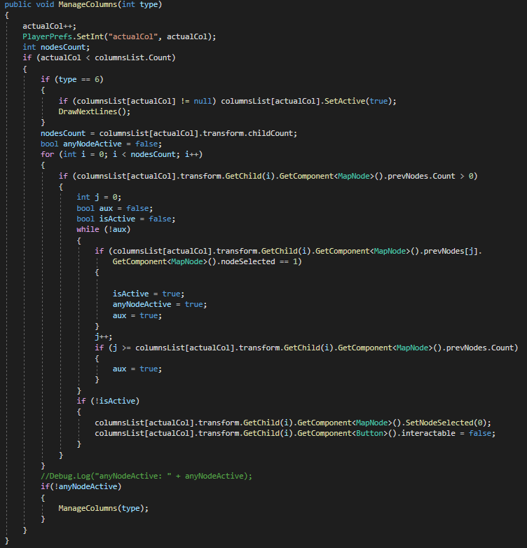

Una vez se hayan activado todas las columnas y se pulse el botón de
“Taberna”, que siempre es el último posible en cada escena de mapa de
nodos, se transiciona a la escena con ese mismo nombre. Ahí se puede
acceder a la formación de equipo y al inventario de personajes \[ver
Mecánica de formación de equipo y Mecánica de información del
personaje\]. Si se pulsa el botón “Atrás” desde la taberna se
transiciona a la siguiente escena de mapa de nodos.

# 

# Conclusiones

Tras la realización de este proyecto se ha llegado a diversas
conclusiones. La primera, es que no existe un tipo de videojuego que
encaje únicamente en el género RPG en función de sus mecánicas, ya que
las que debían formar parte de este para poder definirlo así han ido
cambiando a lo largo del tiempo, se han ido añadiendo algunas,
modificando otras hasta incluso algunas que habían desaparecido volver a
ser importantes para el género.

Sí es cierto que se puede decir que un juego debe tener cierto grado de
personalización en algunas de sus mecánicas para poder ser denominado de
rol, como en les aspecto de los personajes, el estilo de lucha, la
formación de equipo, la toma de decisiones en la historia, la elección
de equipamiento, etc. Además de una mínima narrativa que apoye a la
jugabilidad.

La segunda, es que los juegos RPG son y seguirán siendo una parte
fundamental de la industria. Las posibilidades que alberga desarrollar
un juego con algunas de las características propias de este género son
infinitas, ya que solo dependen de la creatividad del equipo. Los RPG
han ido moldeándose a lo largo del tiempo en función de su lugar de
desarrollo, su estilo de combate, su enfoque en la manera de jugar,
creando una inmensa variedad de títulos y definiciones de lo que podría
ser un juego de rol y seguirán evolucionando.

La tercera, que es muy importante la selección de mecánicas a la hora de
diseñar y desarrollar un juego RPG. La compatibilidad entre ellas es
esencial para que el usuario se enganche y disfrute sintiendo la
sensación de progresión y desarrollo conforme avanza. Todo esto debe
estar acompañado de una buena historia que lo apoye y complete la
experiencia en su totalidad.

A la hora de hacer la aplicación práctica, se ha advertido que por bueno
que sea el desarrollo y la puesta en escena de las mecánicas, si el
diseño de estas no está bien hecho el juego puede perder su calidad. Por
ejemplo, si hacen que el juego sea demasiado fácil o simple, demasiado
difícil o complejo, si hay algunas que no tienen sentido y no aportan
nada a la jugabilidad, si utilizar una se hace demasiado monótono o hay
tantas que hay un exceso de información, etc.

En cuarto y último lugar, que diseñar y desarrollar un juego completo en
solitario que mantenga un nivel de calidad mínimo es una tarea muy
complicada. Además de que supone que esa persona tenga todos los
conocimientos de diseño, desarrollo y arte necesarios, conlleva una gran
cantidad de tiempo.

# 

# Bibliografía

1.  *¿Qué es la jugabilidad en videojuegos?* (3 marzo 2022). Universidad
    Europea.
    <https://universidadeuropea.com/blog/jugabilidad/#:~:text=Se%20refiere%20a%20la%20calidad%20del%20videojuego%20en%20t%C3%A9rminos%20de,comunicaci%C3%B3n%20en%20las%20versiones%20multijugador.>

2.  *Metodología Kanban: qué es y 5 pasos para implementarlo en tu
    empresa*. (2 febrero 2023). Cegos.
    <https://www.cegos.es/actualidad/metodologia-kanban-que-es-y-como-implementarlo>

3.  Cabezas S., G. *Metodología Kanban y diseño de videojuegos*. (4
    septiembre 2022). LinkedIn.
    <https://www.linkedin.com/pulse/metodolog%C3%ADa-kanban-y-dise%C3%B1o-de-videojuegos-sergio-g-cabezas/?trk=portfolio_article-card_title&originalSubdomain=es>

4.  Keith, C. (2020). Chapter 6: Kanban. *Agile Game Development: Build,
    Play, Repeat*. Reino Unido: Pearson Education.
    <https://www.google.es/books/edition/Agile_Game_Development/gtnPEAAAQBAJ?hl=es&gbpv=0&kptab=overview>

5.  Drive. *El RPG ha muerto, larga vida al RPG*. (9 enero 2017).
    Destino RPG.
    <https://www.destinorpg.es/2017/01/el-rpg-ha-muerto-larga-vida-al-rpg.html>

6.  Adell. *Los subgéneros en el género RPG*. (4 abril 2019). Destino
    RPG.
    <https://www.destinorpg.es/2014/05/los-subgeneros-en-el-genero-rpg.html>

7.  Adell. *Puntos importantes en la diferenciación entre RPGs
    orientales y occidentales*. (5 agosto 2017). Destino RPG.
    <https://www.destinorpg.es/2017/08/puntos-importantes-en-la-diferenciacion.html>

8.  DeVuego. *Mundo abierto*. (29 abril 2013).
    <https://www.devuego.es/gamerdic/termino/mundo-abierto/>

9.  Del Águila M., C. *Análisis y modernización del sistema de combate
    por turnos*. (20 julio 2023). Universidad Rey Juan Carlos.
    <https://hdl.handle.net/10115/23363>

10. Tapia A., K. *La Guía Central. Qué son los juegos gacha: todo lo que
    debes saber*. (9 agosto 2022).
    <https://laguiacentral.com/guias/que-son-los-juegos-gacha/>

11. Adell. *El farmeo en los RPGs*. (24 marzo 2014). Destino RPG.
    <https://www.destinorpg.es/2014/03/el-farmeo-en-los-rpgs.html>

12. Adell. *Los elementos en el género RPG \#1*. (7 febrero 2022).
    Destino RPG.
    <https://www.destinorpg.es/2022/02/los-elementos-en-el-genero-rpg-1.html>

13. Calles Q., I. *Narrativa interactiva en videojuegos mediante toma de
    decisiones*. (5 julio 2023). Universidad Rey Juan Carlos.
    <https://hdl.handle.net/10115/22435>
